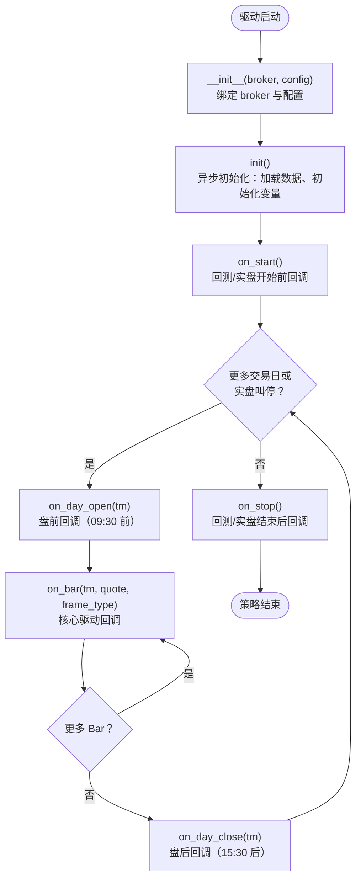

# 技术栈和架构

## 1. 文档定位

本文件是当前阶段的主决议文档，用于quantide 的开发和发布。

约束如下：

1. 本文件优先级高于同目录下其它文件。
2. 旧文档保留作为历史讨论记录，不再视为当前发布方向的权威来源。
3. 对外文档暂不发布详细设计，开发期说明仅保留在 `.dev/`。

## 2. 背景

quantIDE 是一款量化交易软件，提供数据维护、回测、仿真和实盘交易功能。策略通过外部开发工具来开发，使用本应用提供的策略框架以及数据、交易 API。

### 2.1. qmt-gateway

quantIDE 依赖 qmt-gateway 来获得实时行情和实盘交易能力。qmt-gateway 也是同一作者开发。quantIDE 可部署在 linux/windows/mac 上，但 qmt-gateway 只能部署在 windows 上，并且在同一台机器上，需要安装迅投开发的 qmt 及 xtquant sdk。

quantIDE与 qmt-gateway 之间通过 web socket 及RESTful API进行通讯。当 qmt-gateway 要向 quantIDE 主动推送消息（比如实时行情和交易状态更新）时，一般采用 web socket。

1. 仅运行于安装了 QMT 的 Windows 机器。
2. 不承担策略框架职责。
3. 对 quantIDE 暴露稳定且有限的能力：
   - 实时行情推送
   - 下单
   - 撤单
   - 资产/持仓/订单/成交查询
4. qmt-gateway不与quantIDE共享内部实现，只共享协议约定。
5. qmt-gateway 作为 quantIDE与qmt 之间的桥梁，对 quantIDE提交的每一笔订单，都提供跟踪能力。这是通过 quantIDE订单中的 qtoid 来实现的。

qauntIDE 必须不依赖于 xtquant，并且在没有 qmt-gateway 的情况下，也能够运行。不过，在这种状态下，只能运行策略回测和分析，不能进行仿真、实盘交易。

## 3. quantIDE的核心技术栈

使用 python 3.13 作为运行时。

UI 界面使用 FastHTML 和 monster UI构建。行情数据使用 parquet 格式，并主要通过 polars(以及特殊情况下，允许使用 pyarrow) 来读写和访问。交易相关数据及系统维护所需要的数据，由 sqlite3 保存。通过 thread local 技术为每个线程维护一个数据库连接，从而支持多进程、多线程并发访问sqlite 3数据库。

数据访问模块必须提供非常强大的性能，每一行语句都要精心打磨。

### 3.1. 开发环境

1. 同样使用 python 3.13作为运行时。
2. 使用 uv/venv 创建虚拟环境和管理依赖
3. 使用 black进行格式化
4. 使用 ruff 和 mypy 进行语法检查 。
5. 使用 pytest 来运行和管理单元测试。
6. 使用 starlette 自带的 Testclient 进行集成测试。页面样式、动态效果一般手工进行测试。

## 4. 重要架构考虑

1. 配置保存在数据库quantide.db 中。使用操作系统默认的配置文件目录来存储该文件。在系统第一次运行时，通过运行 init-wizard 来完成最重要的配置。详见02-init-wizard.md。
2. quantIDE提供策略框架。该框架既是一系列约定，也提供了抽象基类。派生于该框架的策略，能被quantIDE发现，加载和运行。
3. 策略由运行时驱动，无论是在回测、仿真还是实盘运行时，策略都不需要进行修改。
4. 策略发出的每一个订单，都将通过 qtoid 来进行跟踪。接收和处理订单的系统都要透传，或者自己建立 qtoid 与外部 id 之间的关联。
5. quantIDE将可以运行在 macos/linux/windows 上。它必须不依赖于 xtquant。
6. 界面 layout, style 等约定在03-layout-nav-style.md 文档中说明。
7. 系统从外部数据源（比如 tushare）接收数据时，必须转换成为标准数据格式（见本文对应章节）再存储。
8. 系统支持多个数据源，系统（比如后台更新任务）只使用系统自己的标准数据 API 来获取数据。在初始化时，这些 API 将绑定到对应的适配器上。

### 4.1. 策略零移植

策略代码必须跨模式零修改运行，这是发布态硬性业务目标。

含义是：

1. 同一份策略代码，不因运行模式不同而修改源代码。
2. 策略不感知回测/仿真/实盘差异。
3. 策略仅依赖统一的 broker、data。

运行模式为以下三种之一：

1. `backtest`：历史数据回放 + 本地仿真撮合
2. `paper`: 远程 gateway 行情 + 本地仿真撮合
3. `live`: 远程 gateway 行情 + 远程 gateway 交易

### 4.2. 订单跟踪

1. `qtoid` 是quantide侧订单生命周期的主标识。
2. gateway/QMT 返回的外部订单号是外部标识，不替代 `qtoid`。
3. 订单、成交、UI 展示、策略等待/唤醒都应围绕 `qtoid` 对齐。
4. 在 quantIDE界面展示订单时，除非是为了 troubleshooting 的场合，一般只展示 `qtoid`（甚至为了用户友好，该字段也不必要展示）。

### 4.3. 行情数据字段规范化

我们将建立一套标准化的行情数据交换格式。规定为：

1. 行情数据的`id`是`asset` + `frame`。其中`asset`是资产代码（大写），比如000001.SZ是平安银行。 `frame`则是该条记录对应的时间，是 `datetime.date|datetime.datetime`类型。
2. 其它字段分别为 open, high, low, close, volume, amount，均为64位浮点数。
3. 日线行情还包含`adjust`(复权因子)、`is_st`(是否 st, bool)，`up_limit`(涨停价)和`down_limit`(跌停价)。除`is_st`外，其它都是64位浮点数。
4. 一条完整日线行情记录必须同时包含 asset, frame, open, hight, low, close, volume, amount, adjust, is_st, up_limit 和 down_limit，并且已转换为规定的格式。

这是数据层硬约束。

### 4.4. 事件总线

在系统内部通过 MessageHub 来进行通信。它只用于进程内部通信，而不用于 quantIDE 与gateway 的通信。它的主要作用是用于模块之间的 de-couple，以及支持异步调用。

### 4.5. UI 导航与渲染架构约束

quantIDE 的 Web UI 在共享布局层必须优先采用 fragment 导航，而不是完整页面重绘。

约束如下：

1. 在使用 Header + Sidebar + Main 的共享布局页面中，模块内导航与高频功能切换应优先设计为局部更新。
2. 普通请求仍返回完整页面，以保证直达访问、刷新和首屏加载语义正确。
3. 共享布局导航默认优先采用 `hx-boost` 一类保留链接语义的 fragment 导航机制；仅在特殊交互场景下才退回到显式逐链接配置。
4. 对于 HTMX 请求，后端应优先返回 main content fragment，并通过 OOB 机制同步 sidebar；必要时同步 header，而不是重新渲染整个页面。
5. Sidebar 和 Header 的激活态应继续由后端根据当前 URL 计算，不引入额外的前端业务状态管理。
6. fragment 导航必须保证地址栏、刷新、前进后退和默认滚动语义正确；必要时应显式启用 `hx-push-url` 并在导航完成后重置 main content 滚动位置。
7. 不允许通过中间件解析或改写 HTML 响应体来实现 fragment 导航；full-page / fragment 分流必须发生在布局渲染层或共享辅助函数中。
8. 新开发功能如仍采用“点击导航后整页重刷新”的方式，必须给出明确的技术理由；否则视为违反默认 UI 架构约束。
9. 仅当某页面明确依赖整页初始化、且无法低成本兼容 fragment 导航时，才允许保留完整页面刷新；此类例外必须在对应 spec 中显式说明。

该约束的目标是：

1. 保持 Header + Sidebar 作为稳定壳层，减少切换闪烁。
2. 使系统在现有 FastHTML + HTMX 技术栈下获得更接近 SPA 的交互体验。
3. 避免后续新增页面继续沿用完整页面重绘，导致体验持续退化。

## 策略框架

### 生命期

策略的生命周期包含**构造、初始化、启动、日内循环（含 Bar 循环）、停止**五个阶段。整体流程如下：

各阶段要点：

1. **构造**：`__init__(broker, config)` 仅保存 broker 与配置，不做 I/O。
2. **初始化**：`init()` 是异步方法，实例化后立即调用，可用于加载历史数据、计算指标、初始化账户状态。
3. **启动**：`on_start()` 在回测/实盘正式开始前调用一次，适合订阅行情、设置全局状态。
4. **日内循环**：每个交易日先 `on_day_open(tm)`，再逐根 `on_bar(tm, quote, frame_type)`（核心交易逻辑，可调用 `broker.buy/sell` 与 `record`），日内结束调用 `on_day_close(tm)`。
5. **停止**：`on_stop()` 在整个回测/实盘结束后调用一次，用于清理资源、输出总结。

### 数据获取

策略一般需要在 init 和 on_bar被调用时获取数据。获取数据时使用 get_history (暂定名) 这个 API，最终它会被绑定到 broker 上的同名 API.

### 撮合时机

在每个 on_bar 时，策略都可以发出买卖信号。根据 RuntimeContext 的不同以及是否允许 cheat-on-close，broker 撮合时机和机制也有所不同。

| mode       | cheat-on-close=yes | cheat-on-close=false | comments                                         |
| ---------- | ------------------ | -------------------- | ------------------------------------------------ |
| backtest   | 当日收盘价         | 次日开盘价           | 未成交的订单自动作废，不看成交量                 |
| paper/live | 立即发出           | 次日集合竞价期间发出 | 未成交的订单持续到收盘后自动作废，成交量决定撮合 |

其中 paper 自己负责撮合；它扫描在 order 之后达到的行情数据，根据价格和成交量来决定能否成交；live 则是把订单发送给真实的柜台网关 -- 比如qmt gateway.

