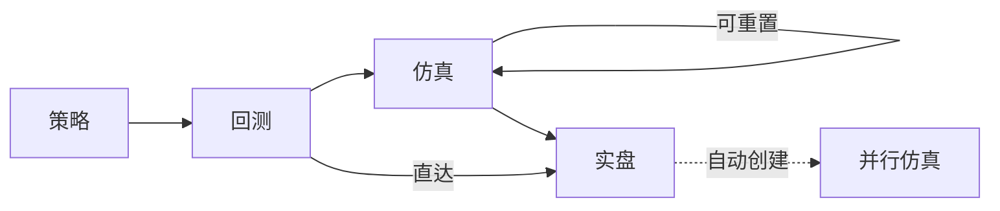

Millionaire 是Quantide量化策略开发框架系列中的大众版。它适合独立量化开发者使用，具有使用成本低（个人电脑 + 年均200元以下数据使用费）、易上手（策略一次开发、自动适应回测、仿真、实盘）和可扩展特点（支持自定义策略）。

Billionaire 是它的升级版，具有内建因子库、因子存储库和分钟级回测等功能。

Zillionaire 是面向专业量化机构的版本，它采用完全不同的高性能、跨网络存储方案，可以同时支持多名研究员同时开发、运行策略，并具有更好的可维护性（多节点、容器化微服务架构）。

Billionaire/Zillionaire 不在仓库实现范围内。以下内容均如非特别说明，特指 Millionaire版本。

## 1. 策略框架

### 1.1. 作为SDK
策略框架要能以 SDK 的方式暴露出来，使得开发者可以在自己习惯的 IDE 中使用，并支持 AI Coding Agent 开发模式: 通过 skill 暴露出数据、交易接口，生成策略模板。

<!-- (1) API 类型标注完备，Agent 可自动理解接口；(2) 提供策略模板/脚手架，Agent 可从模板生成策略代码；(3) 策略开发约定（命名、目录结构、基类继承）以结构化形式记录，可被 Agent 消费。 -->

### 1.2. 自动发现

依据本框架开发的策略，在指定位置（可配置）可以被 Millionaire 扫描，从而列出所有策略，包括它们的名称、描述和参数。

<!-- 建议策略通过 `default_config()` 类方法返回 dict 声明参数（key=参数名, value=默认值）。扫描时框架读取此方法以获得参数列表和默认值，供 UI 展示和 Agent 调用。 -->

### 策略参数

本金、滑点和手续费（印花税及单笔最低请换算成比率，不提供定制）是策略的默认参数。策略还可能有其它参数，需要提供定制接口。

### 1.3. 无感迁移
依据本框架开发的策略，可以无需修改代码，即可以回测、仿真、实盘方式运行。

### 1.4. 下单方式

Millionaire 支持三种下单方式：
1. Cheat-on-Close(按当天收盘价)。在回测时，将以当天收盘价成交；在仿真和实盘时，策略将在尾盘集合竞价时（或者其它指定的时间点）执行，如果有交易信号，则立即发出订单，等待撮合结果。
2. 正常模式（次日开盘价成交）。在回测时，除非开盘价即涨停、跌停（此时不撮合），否则将按照次日的开盘价成交；在仿真和实盘时，将在次日开盘集合竞价时发出委托单：对卖出单，以跌停价下委卖单；对买入单，以涨停价下委买单。
3. 限价单。在回测时，如果指定价格在下一个 bar的low,high之间，则按照指定的价格全部成交。在仿真和实盘时，将以次日开盘集合竞价时发出委托单，由撮合系统处理。

**注意** 三种下单方式下，回测、仿真和实盘的运行结果可能会有差异，这是允许的。

1. Cheat-on-Close 下单方式时，策略由当天 close 触发，以 close 价格成交；仿真、实盘时，必须在尾盘集合竞价（或者用户指定的时间点）执行策略，此时策略可能不触发；触发后，成交价格也不一定是 close。
2. 正常模式中，回测时只要价格匹配，则全部成交；仿真和实盘时，成交多少，取决于当天有多少成交量满足开盘价成交条件。
3. 指定价格成交时，回测时只要价格匹配，则全部成交；仿真和实盘时，成交多少，取决于当天有多少成交量满足指定价格成交条件。

<!-- 支持按股数、按金额、按持仓比例下单-->

### 1.5. 主策略

Millionaire支持的主策略是指只在收盘后（或者接近收盘时）执行，支持按 Cheat-on-Close, 次日开盘价和次日限价单三种方式成交，并可无感运行在回测、paper、live 三种模式下的策略。

以下是策略示例：

**双均线策略** 该策略使用内建数据接口，获得日线行情数据，计算[fast, slow]两个不同周期的均线，并在快线上穿慢线时发出买入信号，在慢线上穿快线时发出卖出信号。回测完毕后，计算常用回测指标并以图形化方式展示净值、参考线、买入点、卖出点和均线指标。根据策略执行时间和成交方式，有以下几种主要模式：

| 模式  | cheat-on-close                                     | 次日开盘                                         | 次日限价                                       |
| ----- | -------------------------------------------------- | ------------------------------------------------ | ---------------------------------------------- |
| 回测  | T0收盘价信号，T0收盘价撮合                         | T0收盘价信号，T1开盘价成交                       | T0收盘价信号，T1限价成交                       |
| paper | T0尾盘信号，实时或者竞价成交 尾盘运行，即时委托 | T0收盘价信号，T1开盘价成交 盘后运行，次日委托 | T0收盘价信号，T1限价成交 盘后运行，次日委托 |
| live | T0尾盘信号，实时或者竞价成交 尾盘运行，即时委托 | T0收盘价信号，T1开盘价成交 盘后运行，次日委托 | T0收盘价信号，T1限价成交 盘后运行，次日委托 |

双均线策略是 Millionaire 内置策略。

<!-- 回测时因为自带未来视角，所以没有所谓的策略『运行时刻』，on_bar 拿到收盘价即可立即撮合并成交。-->

### 1.6. 辅助策略和策略组合

Millionaire 支持编写仅依靠 live 数据的辅助策略。一个主策略可以叠加多个辅助策略。以下是仅依靠 live 数据的辅助策略示例：

**回落卖出策略** 该策略的算法是，当个股价格当天上涨至 m% 后，如果在 n 分钟内下跌超过 k%，则立即卖出。执行该策略需要 tick 级数据。由于缺少历史 tick 数据，该策略只能在仿真和实盘时运行，没有回测数据，作为辅助策略，与其它策略组合使用。

回落卖出策略是 Millionaire 内置策略。

**成本止损策略** 该策略的算法是，对持仓个股，如果跌破买入价的 k%，则立即卖出。

辅助策略需要在 live/paper 运行过程中，能统计出策略的超额收益等指标。

**关于辅助策略超额收益的计算** 以回落卖出策略为例，每次卖出点到当天收盘价的利润就是该策略的超额收益率。成本止损类似。更一般地，我们以卖出点价格为基准，t_n日收盘价时的收益率的负数计为超额收益。

更一般地，我们要求用户自写撰写的辅助策略，自行提供超额收益率（以日为单位），Millionaire 在拿到策略的每日超额收益率之后，负责展示策略的年化、sharpe、sortino 等指标。

<!-- 组合策略的收益计算： 实盘时得到的是主策略+辅助的综合收益，即组合策略的收益。不单独计算此时主策略的收益，或者放在后面实施。 -->

### 1.7. 策略示例

除前述举例策略之外，Millionaire 中要能运行以下策略：

**30分钟强势 T0 策略** 该策略的算法是，每天筛选出前一天强势股，在尾盘时，如果30分钟均线均朝上，则发出买入信号。该策略执行时，需要每天在 day_open 时进行选股，并使用30分钟和日线数据，因此也无法进行回测。

该策略是辅助策略， Millionaire 不内置，最终用户需要自行编写。

## 策略调度

主策略按以下路径进行调度：

策略必须从回测开始，才能进入仿真和实盘（使用该回测的参数）。回测完成后有两条路径：

1. **顺序路径**：回测 → 仿真 → 实盘。仿真可随时重置重跑。
2. **直达实盘**：回测 → 实盘。此时系统自动创建一个仿真实例，以相同参数同步运行，以便实盘停止后仿真可以继续运行。

实盘运行时始终有一个并行仿真实例同步运行。

策略允许多次运行回测。每个策略，最多保留30个回测结果。用户可以对这些回测结果进行查询和管理。

提供 UI 界面来实现策略转回测、paper、live 的调度。在启动回测时，提供界面以改写策略默认参数，运行结果与参数一起保存。回测转 paper/live运行时，不允许改动这些参数（但可以设置资金）

## 2. 数据源与存储

### 2.1. 行情数据
- 日线（个股、指数）：核心历史数据。字段：OHLCV + amount + adjust + is_st + up_limit + down_limit。Parquet 存储，按年分区。数据源：tushare。
- tick、分钟线、30分钟线：仅 live/paper 模式下的实时数据，不保存。

### 2.2. 参考数据
- 交易日历：所有交易所的交易日和非交易日。数据源：tushare。
- 证券列表：全市场股票代码、名称、拼音、上市/退市日期。数据源：tushare。
- is_st：特别处理标记（ST / *ST）。数据源：tushare。

### 2.3. 复权与涨跌停
- adjust（复权因子）：用于前复权/后复权计算。数据源：tushare。
- 涨跌停价：A 股特有，用于撮合判断和限价单比较。数据源：tushare。

### 2.4. 实时行情
- qmt：通过 qmt-gateway 获取实时 tick 和分钟线。仅 live/paper 模式使用。

### 数据同步
 - 定时执行日线行情数据、证券列表、交易日历、st、涨跌停历史数据的同步。
 - 盘前获取当日涨跌停价格、复权因子获取
 - 定时任务可配置，运行有报告跟踪，错误在 UI 上报告
 - 任务错过执行（错误纠正后）重新执行
 - 数据补录

### 数据完整性校验及报告
后台任务，定时执行数据完整性校验，并在 UI 上报告错误。

### 数据查询支持
- 支持用户查询交易日历
- 支持用户按名字、数字和拼音模糊查询个股基本信息
- 支持用户查询个股历史行情并绘制 k 线图

## 3. 策略评估与可视化

### 3.1. 回测指标（最小集合）
- 年化收益率
- 最大回撤
- Sharpe 比率
- Sortino 比率
- Calma 比率
- 胜率
- 盈亏比
- 交易次数
- 基准对比（如沪深 300，用于判断策略 alpha）

### 3.2. 可视化
Millionaire 使用 FastHTML 构建 Web 界面，可做响应式可视化。

核心图表如下：
- 资金曲线（含基准对比线）
- 回撤图
- 交易标注（买入/卖出点标记在 K 线上）
- 月度收益热力图 

### 回测进度可视化

策略在回测时，需要在界面实时更新进度。该界面应该以回测区间为 x 轴，根据 on_bar 进度，逐点绘制策略以及参照标的的净值变化对比图，实时更新回测指标（只有在回测结束时才能计算的除外）及交易标注。

##  账户管理
### 委托和成交记录

- 支持列出三态（回测、paper、live）下的委托记录，按个股、时间段进行查询
- 支持列出三态（回测、paper、live）下的成交记录，按个股、时间段进行查询

### paper/live账户
- 每日收益率查询及净值曲线（可视化）
- 月度收益热力图
- 支持查询最大(n)亏损、最大(m)盈利个股
- paper/live 的账户基本信息（总资产、可用现金、持仓市值、账户盈亏）

## 实盘交易界面

1. 提供基础交易界面，允许用户在紧急情况下，手动交易
2. 显示账户当日委托、成交并实时刷新
3. 显示账户基本信息

## 仿真交易界面

在该界面下：
1. 显示账户基本信息
2. 显示账户当日委托、成交并实时刷新
3. 提供交易界面，供用户补单（防止自动化失败的补救措施）

## dry-run 模式
允许正在实盘的策略进入 dry-run 模式，此模式下，策略正常运行，但并不会下委托。期间交易信号会被记录，但数据表现无法呈现。建议同一策略，在进入实盘时，同时开启仿真进（自动开启）行对比。

<!-- 实盘交易信号发出后，能否成交、成交量是多少无法估计，即使开启仿真也无法做到重现；为降低实现难度，我们要求同一策略，在进入实盘时，同时开启仿真 -->

## 消息通知

用户需要在以下事件发生时，收到微信通知：

1. 委托和成交
2. 委托和成交失败
3. 实盘交易网关断开

微信通知在系统设置界面中配置，通过二维码扫描来启用。

## 系统配置

基于图形化的系统配置。系统在安装后的首次启动时，运行 init-wizard(通过web)来引导用户配置关键项，比如：

- 登录密码
- qmt-gateway 连接
- 通知渠道配置
- 数据源
- 数据目录等。

## 安装和运行

程序可运行在 mac, linux 和 windows 下。在 mac/liunux 下提供基于 shell 的安装；在 windows 下提供基于图形界面的安装。

发行时自带 embedded python 和 get-pip，创建虚拟运行环境，始终在虚拟运行环境下启动，以服务方式运行，并随开机自动启动。

## 限制声明

1. Millionaire 仅支持日线行情存储和回测，实盘中配合 qmt-gateway 可获得当日实时行情数据(1m, 30m, 1d)，但不存储。
2. 在 Millionaire 中， 策略不能感知运行模式
3. Stop 单在 Millionaire 中，作为辅助策略的一部分实现，不作为单独订单类型
4. Market-on-Close暂不支持