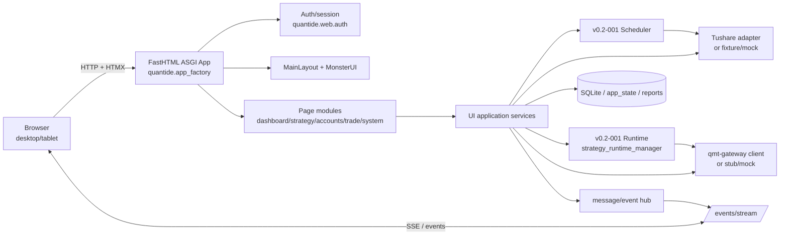
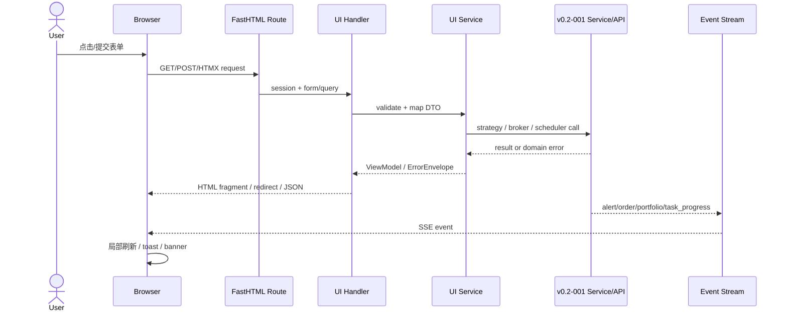
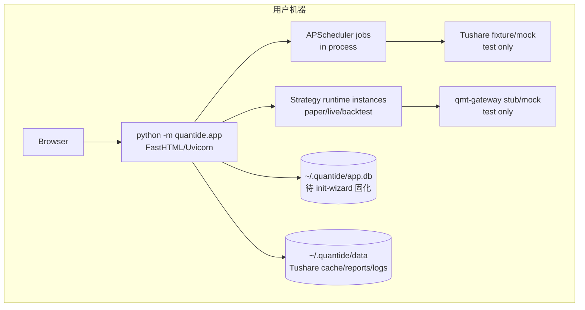
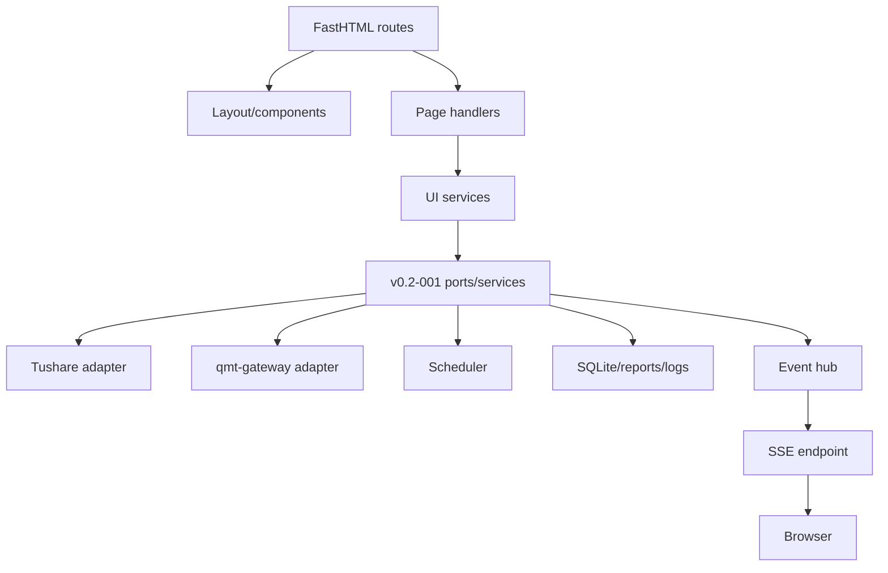

# Millionaire UI — Architecture Design

- **Spec ID**: v0.2-002-ui
- **阶段**: M-ARCH
- **上游契约**: v0.2-001-strategy-framework
- **实现基线**: 继承现有 `quantide/` Python 3.13 + FastHTML 架构
- **设计目标**: Devon 可按模块边界实现; Shield 可按接口与 test-plan 准备 L2/L3 环境

---

## 1. 概述

v0.2-002-ui 是 Millionaire 的 UI 前端层, 负责把 v0.2-001 后台服务能力暴露为本地浏览器可操作界面。

| 项 | 决策 |
| --- | --- |
| Web 框架 | FastHTML, 沿用现有 `quantide.app_factory.create_app()` + mounted sub-apps |
| UI 组件 | MonsterUI + 现有 `quantide.web.theme.AppTheme` |
| 数据后端 | v0.2-001 strategy framework: Tushare / qmt-gateway / scheduler / runtime manager |
| 用户角色 | 单一管理员 `admin`; 无注册、无多用户、无移动端同步 |
| 部署形态 | 本地单机部署, 浏览器访问, 单进程 Web 服务 + 进程内 scheduler/runtime |
| 实时更新 | 采用 SSE 作为 UI 推送主协议; WebSocket 仅保留兼容既有回测页面的迁移路径 |
| 持久化 | 服务端 SQLite/app_state/session + 前端 localStorage 保存非敏感 UI 状态 |

现有仓库已经有 `quantide/app.py`, `quantide/app_factory.py`, `quantide/web/pages/*`, `quantide/web/auth/*`, `quantide/web/layouts/*`, `quantide/service/*`, `quantide/core/runtime/*`。本架构不另起新项目, 而是在这些边界内补齐 UI spec 所需页面、路由、事件与适配器。

---

## 2. 架构图

### 2.1 整体组件图

### 2.2 数据流图

### 2.3 部署图

---

## 3. 模块划分与边界

### 3.1 系统壳层与认证 — spec §1.1 / FR-0110~0180

| 模块 | 现有/目标位置 | 职责 | 不负责 |
| --- | --- | --- | --- |
| App factory | `quantide/app_factory.py` | 创建 FastHTML app、挂载 sub-app、注册 middleware、注入 runtime | 页面业务渲染 |
| Init guard | `quantide/web/middleware_init.py` | 未初始化时把非 wizard 路由重定向到 wizard | wizard 步骤校验 |
| Auth | `quantide/web/auth/*` | 登录、登出、session、密码 hash、改密 | 注册、多用户、登录审计 |
| Feature guard | `quantide/web/middleware_feature.py` | A 类降级路由拦截、交易入口禁用 | B 类临时连接状态判定 |
| Layout | `quantide/web/layouts/main.py`, `components/header.py`, `components/sidebar.py` | header/sidebar/main, localStorage hook, alert icon, banner slot | 具体页面数据加载 |
| Alert shell | 新增/扩展 `quantide/web/pages/notify.py` | 告警中心列表、未读计数、批量确认 | 外部通知发送 |

### 3.2 概览 — spec §1.2 / FR-0201~0203

| 模块 | 目标位置 | 职责 | 数据来源 |
| --- | --- | --- | --- |
| Dashboard page | `quantide/web/pages/home.py` 或 `dashboard.py` | `/dashboard` 与 `/` 登录后概览; 区块顺序: 告警→账户→任务 | Alert service, account service, scheduler service |
| Dashboard service | `quantide/web/services/dashboard.py` | 聚合 ViewModel, 排序、截断、跳转链接 | v0.2-001 account/scheduler APIs |
| Degraded widget | `quantide/web/components/degraded.py` | 局部失败占位、重试按钮、stale 标记 | ErrorEnvelope |

### 3.3 策略 — spec §1.3 / 16 FR

| 模块 | 目标位置 | 职责 | 上游 FR |
| --- | --- | --- | --- |
| Strategy page | `quantide/web/pages/strategy.py` | 策略选择器、扫描、屏蔽/删除、回测报告入口 | 001-FR-020 |
| Runtime form | `quantide/web/components/runtime_params.py` | 本金/滑点/税费/佣金/最低佣金表单与校验 | 001-FR-200 |
| Backtest UI | `quantide/web/pages/strategy.py` 拆分为 backtest 子模块 | 启动回测、进度、报告四页签、日志清理 | 001-FR-230/300/310/380 |
| Runtime control | `quantide/web/services/runtime_control.py` | 转仿真/实盘、停止、dry-run、状态徽章 | 001-FR-230/240/250/440 |
| Risk event UI | `quantide/web/pages/system/risk_events.py` | 风控事件、reason 分组、超额收益展示 | 001-FR-360 |
| Chart adapter | `quantide/web/components/charts/*` | 净值/回撤/月度热力/K 线的数据 schema 到 DOM | 001 评估/行情输出 |

### 3.4 账户 — spec §1.4 / FR-0390~0411

| 模块 | 目标位置 | 职责 | 关键状态 |
| --- | --- | --- | --- |
| Accounts overview | `quantide/web/pages/accounts.py` | `/accounts`, 总账户固定首行、策略虚拟账户过滤 | `account.hidden`, `display_hidden_accounts` |
| Account detail | `quantide/web/pages/accounts.py` | paper/live 详情、每日收益、净值、热力图、最大盈亏 | portfolio metrics |
| Account lifecycle | `quantide/web/services/accounts.py` | 隐藏/取消隐藏规则与合计排除 | 服务端 hidden 字段 |

### 3.5 交易 — spec §1.5 / FR-0400/0420/0430

| 模块 | 目标位置 | 职责 | 上游 FR |
| --- | --- | --- | --- |
| Live trade page | `quantide/web/pages/trade_main.py` + `live.py` | 实盘策略选择、下单辅助、委托/成交刷新、撤单 | 001-FR-210/220/420 |
| Paper trade page | `quantide/web/pages/paper.py` | 仿真补单, 无下单辅助 | 001-FR-210/220 |
| Trade history | `history_orders.py`, `history_trades.py` | 回测/paper/live 委托成交查询 | 001-FR-210/310 |
| Gateway adapter | `quantide/core/runtime/gateway_client.py` | 下单、撤单、状态检测、错误映射 | qmt-gateway |

### 3.6 系统管理 — spec §1.6 / FR-0310~0340

| 模块 | 目标位置 | 职责 |
| --- | --- | --- |
| Task manager | `quantide/web/pages/system/jobs.py` | 任务列表、启停、立即执行、cron、历史、进度 |
| Integrity report | `quantide/web/pages/system/datasource.py` 或 `integrity.py` | 缺日、重复日、空值率、历史 |
| Stock/Kline query | `quantide/web/apis/analysis/*`, `components/analysis/*` | 股票模糊查询、K 线图、hover tooltip |
| Gateway manager | `quantide/web/pages/system/gateway.py` | 单 gateway 配置、测试、保存、状态 |

### 3.7 事件通知 — spec §1.7 / FR-0450

| 模块 | 目标位置 | 职责 | 不负责 |
| --- | --- | --- | --- |
| Notification settings | `quantide/web/pages/notify.py` 或 `system/notifications.py` | 微信二维码、IM/邮件接收方、订阅事件类型 | 外部渠道底层发送可靠性 |
| Alert service | `quantide/core/notifications.py` | UI 告警记录、未读、确认、事件分发 | 页面布局 |
| Push endpoint | `/events/stream` | 向浏览器推送 alert/order/portfolio/task_progress | 业务计算 |

### 3.8 系统配置 — spec §1.8 / FR-0460

| 模块 | 目标位置 | 职责 |
| --- | --- | --- |
| Wizard page | `quantide/web/pages/init_wizard.py` | 步骤式引导、必选/可选、重试/跳过、重新配置模式 |
| Wizard service | `quantide/service/init_wizard.py`, `core/init_wizard_steps.py` | 状态持久化、步骤校验、待处理项、feature status |
| Download progress | wizard + `/events/stream` | 下载子任务百分比、当前步骤名、断线重连后恢复 |

### 3.9 NFR 支撑模块 — spec §3 / 7 NFR

| NFR | 架构支撑 |
| --- | --- |
| NFR-0010 响应性 | 分页/虚拟滚动、HTMX 局部刷新、SSE 推送, 关键页面 LCP <2s |
| NFR-0020 可访问性 | MonsterUI 语义组件 + ARIA role + axe 检查 |
| NFR-0030 错误降级 | ErrorEnvelope + degraded component + retry countdown |
| NFR-0040 视觉规范 | `AppTheme` 统一 token, 禁止大面积红色背景 |
| NFR-0050 局部刷新隔离 | 每个页面区块独立 endpoint/fragment, 失败不清空整页 |
| NFR-0060 长任务交互 | TaskProgress schema + SSE + 可重入任务状态 |
| NFR-0070 localStorage | 仅保存 sidebar/filter/runtime defaults 等非敏感 key |

---

## 4. 依赖关系

依赖方向只允许 UI 层调用 v0.2-001 服务/端口, 不允许 v0.2-001 反向依赖页面组件。页面 handler 不直接访问第三方服务; 统一通过 UI service / runtime / registry 适配, 便于 Shield 在 L2/L3 注入 Tushare mock 与 qmt-gateway stub。

---

## 5. 技术栈与版本

| 类别 | 选择 | 版本/约束 | 解决的问题 | 放弃的替代 | 主要风险 |
| --- | --- | --- | --- | --- | --- |
| Python runtime | Python | `>=3.13,<4.0` | 继承现有项目运行时 | Node/Go 独立 UI 服务 | 新版本生态个别包兼容性 |
| Web framework | FastHTML | `python-fasthtml ^0.12.36` | SSR + HTMX 局部刷新, 与现有 app 匹配 | FastAPI + React | 复杂交互需谨慎拆分, 避免大文件 |
| UI library | MonsterUI | `monsterui ^1.0.36` | 快速统一组件风格 | 自写 CSS / Tailwind only | 默认样式可能与 NFR-0040 冲突, 需 AppTheme 覆盖 |
| Push protocol | SSE | Starlette `StreamingResponse` | 单向实时通知/进度足够, 易测, 自动重连 | WebSocket 全双工 | 只能单向; 既有 WebSocket 回测代码需迁移或兼容 |
| Async jobs | APScheduler | `apscheduler ^3.10.4` | 数据同步任务、cron 管理 | Celery/RQ | 单进程任务不适合分布式, 但本地部署可接受 |
| Persistence | SQLite + sqlite-utils | `sqlite-utils ^3.39` | 本地 app_state/session/UI 状态 | PostgreSQL | 并发写入有限, 单用户可接受 |
| Dataframe | Polars/Pandas | `polars ^1.36.1`, `pandas ^2.3.3` | 行情/指标数据处理 | 纯 pandas | 双栈转换成本 |
| Market data | Tushare | `tushare ^1.4.25` | 历史/参考数据 | Akshare | token/网络不稳定, 测试必须 fixture |
| Gateway | qmt-gateway client | existing HTTP adapter | 实盘/仿真连接 | 直连 QMT 客户端 | 网关离线/鉴权失败需可降级 |
| Password hash | bcrypt | `bcrypt ^5.0.0` | 管理员密码 hash | 明文/sha256 | 需防止 hash 泄露到 localStorage |
| Test | pytest + Playwright | pytest 9, Playwright Python | 与 test-plan 一致 | Selenium | Playwright 浏览器安装成本 |
| Lint/type | ruff/mypy | ruff `<1`, mypy `<2` | 保持项目质量 | flake8/black | 既有代码可能需分阶段修复 |

---

## 6. 推送机制决策

本轮为 v0.2-002-ui 固定 **SSE** 为主推送协议, 端点为 `/events/stream`。

| 决策点 | 说明 |
| --- | --- |
| 解决问题 | FR-0160 未读数非轮询刷新、FR-0420 委托/成交 <5s、FR-0460/0310/0080 长任务进度 |
| 放弃替代 | WebSocket 全双工。UI 当前只需要服务端到浏览器推送; 用户操作仍走 HTTP/HTMX POST |
| 风险 | 既有 `strategy.py` 引入 WebSocket; M-DEV 可保留兼容但新契约以 SSE 为准 |
| 降级 | SSE 断线时浏览器显示“重连中”; 已加载列表可浏览; 重连后服务端按 cursor/latest snapshot 补发 |

---

## 7. 部署架构

| 部署项 | 决策 |
| --- | --- |
| 启动命令 | `python -m quantide.app` 或后续包装脚本 |
| Web 监听 | init-wizard 决定 host/port/url_prefix; 默认本机监听 |
| 单实例 | 继承 `get_pid_file_path()` + `_check_single_instance()` |
| 数据目录 | `~/.quantide/` 作为默认候选; 最终由 init-wizard 持久化 |
| 配置库 | `~/.quantide/app.db` 候选; 当前代码通过 `get_app_db_path()` 解析 |
| 数据同步 | Web 进程内 scheduler; 任务状态写入 app_state/history |
| 外部依赖 | Tushare 网络/API, qmt-gateway 本地/局域网服务 |
| 测试部署 | L2/L3 使用临时 app_config_dir + Tushare fixture + qmt-gateway stub |

---

## 8. 数据流设计

### 8.1 用户操作数据流

1. Browser 发起 GET/POST/HTMX 请求。
2. FastHTML route 经过 InitCheckMiddleware / Auth beforeware / FeatureCheckMiddleware。
3. Handler 读取 query/form/session, 映射为接口契约中的 DTO。
4. UI service 调用 v0.2-001 API 或本地 repository。
5. 成功返回 HTML page/fragment/redirect; 失败返回 ErrorEnvelope 或错误页。
6. 对用户可见的成功/失败事件同时可触发 toast 与告警记录。

### 8.2 实时数据流

1. v0.2-001 runtime/scheduler/gateway 产生事件。
2. UI event adapter 统一为 `PushEvent`。
3. `/events/stream` 按 `event:` + JSON `data:` 向浏览器推送。
4. Browser 根据 `type` 更新告警未读数、委托/成交列表、portfolio 指标、任务进度。

### 8.3 长任务数据流

| 场景 | 后台状态 | 前端表现 | 可重入 |
| --- | --- | --- | --- |
| init-wizard 下载 | step/subtask/progress/pending | 百分比 + 当前步骤 + retry/skip | `/wizard/progress` 恢复当前状态 |
| 回测 | processed_days/total_days/stage | x 轴进度 + 净值逐点 + 占位指标 | 报告/日志持久化后恢复 |
| 数据同步任务 | task_name/progress/status/history | 任务行运行中 + 进度 + 历史 | `/system/tasks` 显示最近状态 |

---

## 9. 错误处理与降级

| 场景 | 架构处理 | UI 表现 | 测试观察点 |
| --- | --- | --- | --- |
| Tushare 不可用 | adapter 返回 `DATA_SOURCE_UNAVAILABLE` | 表格上方“数据加载失败, 正在重试...” + 倒计时 | HTTP 200 + degraded fragment |
| qmt-gateway 未配置 | Feature guard 识别 A 类降级 | 交易/仿真入口禁用; 直接 URL 返回 503 | `/trade/live` status 503 |
| qmt-gateway 断开 | gateway health event 识别 B 类降级 | 顶部黄色 banner + 红色 ⚠ + 红色文字 + 告警中心链接 | `gateway_status=offline` push |
| 下单失败 | gateway/domain error 映射 | 白底红边 error toast; 表单保留 | `BROKER_RUNTIME_ERROR` |
| 局部刷新失败 | fragment endpoint 捕获 ErrorEnvelope | 区块占位 + retry; 其他区块不变 | NFR-0050 L2/L3 |
| 推送断线 | EventSource reconnect | 告警图标/进度区显示“重连中” | 断开 SSE stub |

A 类降级禁用实盘、仿真、转入相关入口; 回测与网关管理仍可用。B 类降级只提示 stale/断连, 不清空主内容, 不升级为 A 类。

---

## 10. 安全设计

| 项 | 决策 |
| --- | --- |
| 密码 | 服务端 bcrypt hash; init-wizard 创建 admin; 改密需旧密码 |
| Session | 服务端 session/cookie; 不做超时自动登出, 仅主动登出清除 |
| localStorage | 仅存 `sidebar_collapsed`, `display_hidden_accounts`, filter, runtime defaults; 禁止密码/session token/api key |
| CSRF | 单用户本地部署且无跨站业务入口; 不额外引入 CSRF 框架 |
| API key | qmt-gateway/Tushare token 仅服务端保存; UI 表单可编辑但不可进入 localStorage |
| 错误信息 | 用户可见 message 去除敏感 token/path; loguru 可记录开发诊断 |

---

## 11. 架构约束与实施顺序

1. 先补齐 `interfaces.md` 中定义的路由与 DTO; 页面实现不得新增不可测试的隐式出口。
2. 大文件页面如 `strategy.py` 后续拆分时保持路由兼容, 拆分目标是 page handler / component / service 三层。
3. 所有外部依赖通过 adapter/registry 注入, L2/L3 不访问真实 Tushare/qmt-gateway。
4. 所有长任务必须有 snapshot API 或当前状态 fragment, 不能只依赖推送瞬时事件。
5. 视觉规范以 NFR-0040 为准: banner 黄底, 错误强调使用红色图标/文字/边框, 不使用大面积红底。

---

## 12. Devon/Shield 启动判断

- Devon 可按本文件模块边界实现页面、服务、adapter 与 SSE endpoint。
- Shield 可按 test-plan 使用临时配置目录、Tushare fixture、qmt-gateway stub 与 Playwright 路径准备 L3。
- 所有 acceptance 可通过 interfaces.md 中的 HTTP route / schema / PushEvent / ErrorEnvelope 观察。
