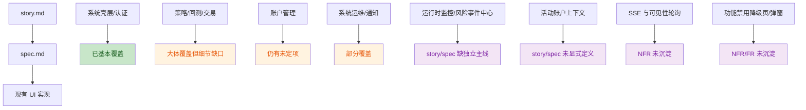

# v0.2-002-ui `spec.md` Review

## 原始提示

> 再次登录到 mini-one-vpn 上，进入~/workspace/millionaire 目录，对~/workspace/millionaire/.louke/project/specs/v0.2-002-ui/spec.md进行评审。
>
> 目标：
>
> 1. 现有的 spec 能否完整覆盖 story?
> 2. story 是否完整？
> 3. 是否存在非功能性需求未挖掘（目前未发布，没有数据和版本迁移需求）
>
> 在进行探索时，你可以查看现有的代码，以发现应该有、但没写出来的 story/spec
>
> 你的 review 意见，连同本提示，写入到~/workspace/millionaire/.louke/project/specs/v0.2-002-ui/spec-review.md

## 审阅结论

- 结论 1：`spec.md` 目前**不能算完整覆盖** `story.md`。它已经比 `story` 更细，但仍有若干关键 UI 主线没有被收敛成完整 FR。
- 结论 2：`story.md` 目前**也还不完整，而且存在几处已被后续讨论推翻但尚未回写的陈述**。
- 结论 3：非功能需求目前**明显不足**，尤其缺少实时更新机制、局部刷新/防闪烁、长任务进度、降级行为、状态持久化这几类约束。

## 覆盖关系图

## 主要问题

### 1. `spec` 仍未完整覆盖 `story`

#### 1.1 策略管理与回测报告管理还没被完整拆成 FR

> **Aaron:** 同意本段。

`story.md` 里的以下内容，在 `spec.md` 中仍未被完整落成可执行需求：

- `story §3.1`
  - 手动扫描策略更新
  - 屏蔽策略后，该策略及其回测结果不可见
  - 删除自定义策略时，关联回测报告一起删除
- `story §3.2`
  - 某策略下“所有回测报告”的列表视图
  - 按年化、Sharpe、Sortino、最大回撤排序
  - 删除单次回测报告、删除全部回测报告
  - 删除已保存日志

`spec.md` 里的 `UI-FR-010`、`UI-FR-040`、`UI-FR-080` 已覆盖“扫描入口 / 启动回测 / 回测报告内容”，但**没有把“报告列表治理”和“隐藏/可见性规则”定义完整**。

代码侧也已经说明这些不是边角需求，而是主线能力：`quantide/web/pages/strategy.py` 已经存在扫描工具栏、回测报告 tabs、年化排序、删除报告、日志保存/删除等实现痕迹。

#### 1.2 运行中策略的“运维控制台”缺位

`story §3.3` 写了：

- 列出所有正在进行的仿真/实盘策略
- 查看运行详情
- 暂停 / 终止 / 再启动
- 查看状态

但 `spec.md` 主要把这些能力分散在：

- `UI-FR-040` 停止
- `UI-FR-060` dry-run

这不足以支撑一个完整的运行时操作面。当前缺少明确 FR 去定义：

> **Aaron:** 这部分正确吗？ 运行时实例不就是虚拟账户吗？

- 运行时实例列表
- 状态枚举（running / blocked / failed / idle / dry-run / live / paper）
- block / unblock
- 最近错误
- 风险事件联动
- 心跳/更新时间

而代码里这条主线已经很明显：

- `quantide/web/pages/system/runtime_monitor.py`
- `quantide/web/pages/system/runtime_support.py`
- `quantide/web/pages/system/risk_events.py`
- `quantide/web/components/header.py`

这意味着 **story/spec 少了一条“系统运行保障中心”主线**。

#### 1.4 通知故事只覆盖了“配置”，没覆盖“UI 内通知”

`story §7` 明确写了三层通知：

1. UI 界面及时展示并自动消失的通知
2. 集中查看事件通知
3. 通过 IM / 邮件 收到事件通知

但 `spec.md` 目前只有：

- `UI-FR-A160` 告警中心
- `UI-FR-450` 通知配置界面

缺的部分是：

- 页面内 toast / banner 的触发、样式、自动消失规则
- 成功、失败、离线暂存这几类反馈的一致约束

> **Aaron:** 同意

#### 3.2 缺少“局部刷新不闪屏”与“失败隔离”约束

交易页代码已经明显在做局部失败隔离，避免资产/持仓/委托任一失败时整页空白：

- `quantide/web/pages/trade_main.py`

对于量化 UI，这应该上升为 NFR：

- 局部数据失败不能导致整页失效
- 局部刷新不得造成整页跳动或闪屏
- 失败区域要有占位和重试提示

#### 3.3 缺少“长任务交互”约束

初始化向导和数据同步都属于长任务，但 NFR 未定义：

- 进度展示最小粒度
- 任务中断后的恢复策略
- SSE 断线后的界面行为
- 用户关闭页面再回来后的恢复方式

这会直接影响 init-wizard 与数据维护页面的一致性。

#### 3.4 缺少“本地状态持久化”约束

当前功能中已经隐含多类需要记住的状态：

- 侧边栏折叠状态
- 最近一次运行时参数
- 活动账户
- 是否显示隐藏账户

`spec.md` 只在少数地方零散提到“记住”，没有统一说明：

- 存本地还是服务端 session
- 持久化周期
- 是否跨浏览器保留

这属于应该补齐的 NFR/交互约束。
