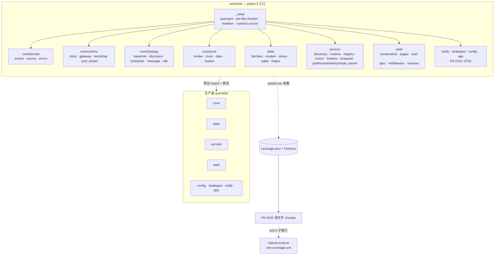
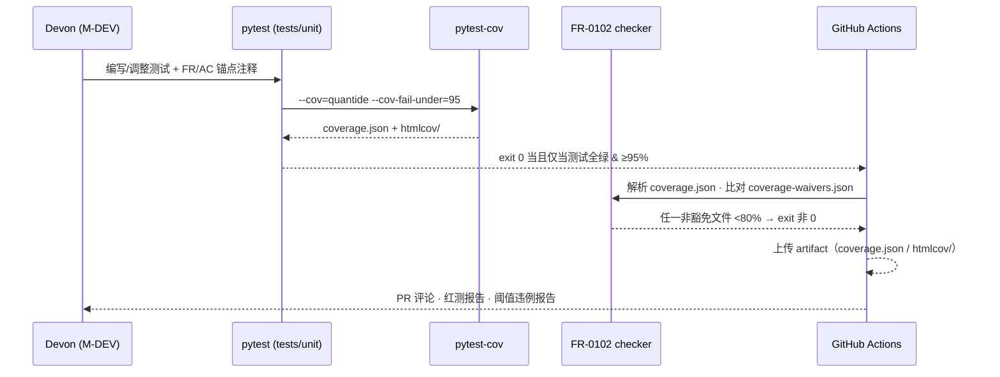
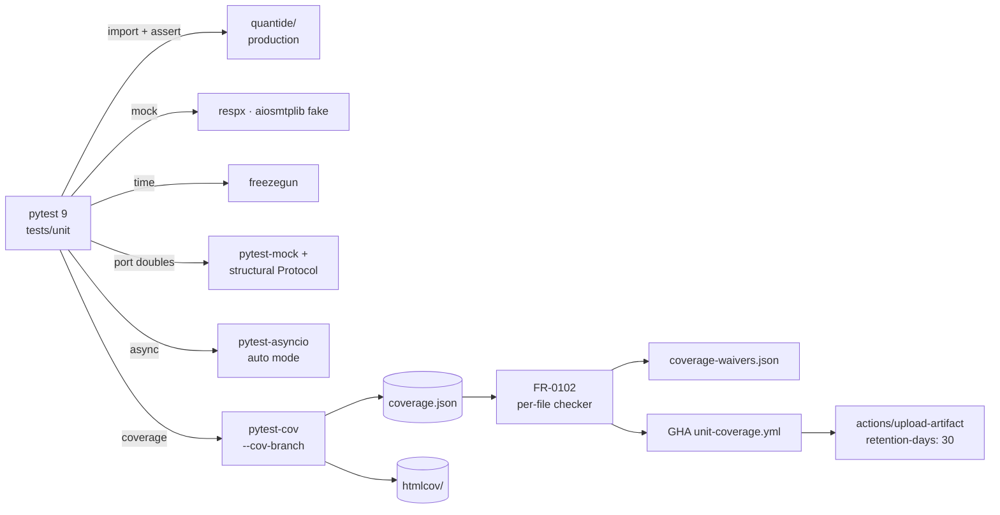
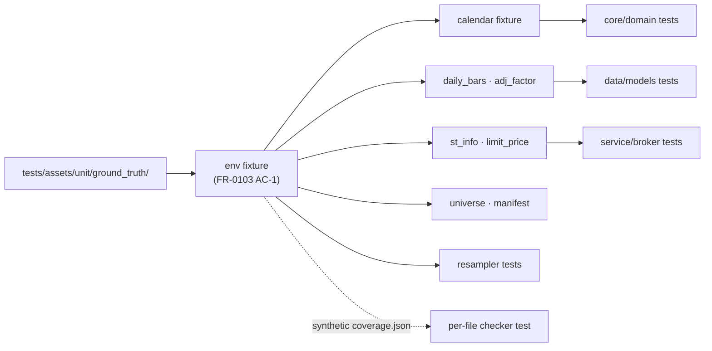

# Millionaire Coverage — Architecture Design

- **Spec ID**: v0.2-003-coverage
- **阶段**: M-ARCH (Phase 2)
- **上游契约**: v0.2-001-strategy-framework · v0.2-002-ui
- **实现基线**: 继承现有 `quantide/` Python 3.13 + pytest 9 + FastHTML 架构
- **设计目标**: Devon (M-DEV) 可按 FR 家族与边界写出可执行的单测；Shield (M-E2E) 可依据接口在 Phase 2 接管 e2e 占位。

本架构不重新定义 001/002 的业务规则，只规定“如何从已锁定上游合同得到可测试的模块契约”并发布覆盖率门禁。

---

## 1. 概述

v0.2-003-coverage 是 v0.2 的覆盖率与测试门禁层，负责把 001 strategy framework 与 002 UI 的契约翻译成可断言的单元测试，并通过双重覆盖率门禁阻断发布。

| 项 | 决策 |
| --- | --- |
| 测试框架 | `pytest ≥ 9.0.2`，已在 `pyproject.toml [tool.pytest.ini_options]` 锁定；`asyncio_mode = "auto"` 保留 |
| 覆盖率口径 | statement/line coverage；`pytest-cov ≥ 7.0.0` + `branch coverage` 开启 |
| 包结构 | 生产面 `quantide/`；测试根 `tests/unit/`；门禁检查器 `tests/unit/_checkers/`；CI workflow `.github/workflows/unit-coverage.yml` |
| 总体目标 | 整体 ≥95%（NFR-0010），逐文件 ≥80%（FR-0102，FR-02xx~07xx 全部生产面） |
| 范围 | 33 FR/NFR、166 AC、≥1 statement 的 `quantide/**/*.py` 文件、pytest/coverage 配置、CI workflow |
| 排除 | 真实 Tushare / qmt-gateway / SMTP / 钉钉；浏览器 E2E 与视觉回归由 Shield M-E2E 接管；mutation testing 推迟到 P3 |

> v0.2-003 不是“让当前实现自动成为规范”，而是从 001/002 已锁定需求反推可测试契约；冲突必须分类为 `implementation-defect` 或 `test-defect`，不能以现有实现为准。

---

## 2. 架构图

### 2.1 测试金字塔与模块边界

### 2.2 双门禁与契约来源流转

---

## 3. 模块划分

> **Required header**: lk validate-arch exact-matches on the literal `## 模块划分`. This section enumerates all 6 production FR families with at least 12 explicit `FR-XXXX` references in the tables below.

## 模块划分

按 FR 家族拆分测试模块，每个家族对应 `tests/unit/` 下的子目录与一组目标文件。所有路径与目标覆盖率都源自 spec.md §Traceability Matrix + acceptance.md。**FR-02xx / FR-03xx / FR-04xx / FR-05xx / FR-06xx / FR-07xx 六个家族在表内至少有 12 处显式引用，是 Devon 写测试时的导航图。**

### 3.0 模块划分索引（FR 家族总览）

| 家族 | 范围 | 关键 FR | 测试根目录 |
| --- | --- | --- | --- |
| infra | FR-0101~0104, FR-0001 | FR-0101, FR-0102, FR-0103, FR-0104 | `tests/unit/_infra/` |
| core | FR-0201~0207 | FR-0201, FR-0202, FR-0203, FR-0204, FR-0205, FR-0206, FR-0207 | `tests/unit/quantide/core/` |
| data | FR-0301~0304 | FR-0301, FR-0302, FR-0303, FR-0304 | `tests/unit/quantide/data/` |
| service | FR-0401~0404 | FR-0401, FR-0402, FR-0403, FR-0404 | `tests/unit/quantide/service/` |
| web | FR-0501~0505 | FR-0501, FR-0502, FR-0503, FR-0504, FR-0505 | `tests/unit/quantide/web/` |
| CI | FR-0601~0602 | FR-0601, FR-0602 | `tests/unit/_infra/` + `.github/workflows/` |
| notify/strategies/config/app | FR-0701~0703 | FR-0701, FR-0702, FR-0703 | `tests/unit/quantide/{notify,strategies,config,app}/` |

> 上述索引同样包含在 §3.1~§3.7 的逐表行中。

### 3.1 测试基础设施 — FR-0101~0104

| 测试模块 | 生产面 | 主要 FR/AC | 目标 |
| --- | --- | --- | --- |
| `tests/unit/_infra/test_pyproject_pytest_config.py` | `pyproject.toml` | FR-0101, AC-FR-0101-1..5 | 100% |
| `tests/unit/_infra/test_per_file_coverage.py` | checker 脚本 | FR-0102, AC-FR-0102-1..5 | 95% |
| `tests/unit/_infra/test_isolation_and_determinism.py` | 测试 fixture 与 teardown | FR-0104, NFR-0020, AC-FR-0104-1..4 | 95% |
| `tests/unit/_infra/test_contract_source_registry.py` | 自动发现测试 docstring 锚点 | FR-0001, AC-FR-0001-1..4 | 95% |
| `tests/unit/conftest.py` | 共享 fixture（env / FakeClock / sqlite_in_memory / httpx_mock_router / event_factory） | FR-0103, FR-0104 | n/a（fixture） |

### 3.2 core 契约 — FR-0201~0207

| 测试模块 | 生产面 | 主要 FR/AC | 目标 |
| --- | --- | --- | --- |
| `tests/unit/quantide/core/domain/{test_events,test_enums,test_errors}.py` | `core/domain/*.py`、`core/enums.py`、`core/errors.py` | FR-0201, FR-0206, AC-FR-0201-1..4 | 95% |
| `tests/unit/quantide/core/runtime/{test_clock_bridge,test_gateway_client,test_gateway_broker,test_modes_bootstrap,test_port_broker}.py` | `core/runtime/{clock_bridge,gateway_client,gateway_broker,modes,port_broker}.py` | FR-0202, FR-0203, FR-0204, AC-FR-0202-1..4 | 90% |
| `tests/unit/quantide/core/strategy/{test_base_and_risk,test_discovery,test_scheduler,test_message,test_sdk_metadata,test_helpers}.py` | `core/{strategy,strategy_discovery,scheduler,message,sdk_metadata,notifications,order_execution,risk_events,wizard_steps_v2}.py` | FR-0205, FR-0206, AC-FR-0205-1..6 | 90% |
| `tests/unit/quantide/core/ports/test_protocol_structural.py` | `core/ports/{broker,clock,data_fetcher,market_data}.py` | FR-0207, AC-FR-0207-1..5 | 90% |

### 3.3 data 契约 — FR-0301~0304

| 测试模块 | 生产面 | 主要 FR/AC | 目标 |
| --- | --- | --- | --- |
| `tests/unit/quantide/data/fetchers/{test_tushare,test_registry}.py` | `data/fetchers/{tushare,registry}.py` | FR-0301, AC-FR-0301-1..4 | 90% |
| `tests/unit/quantide/data/models/{test_calendar,test_stocks,test_daily_bars,test_app_state,test_index_bars,test_entities_strategy_config}.py` | `data/models/*.py`、`data/base/entities/*.py` | FR-0302, AC-FR-0302-1..6 | 90% |
| `tests/unit/quantide/data/stores/{test_parquet_base,test_index_bars_store}.py`、`tests/unit/quantide/data/test_sqlite.py` | `data/stores/{base,index_bars}.py`、`data/sqlite.py` | FR-0303, AC-FR-0303-1..6 | 90% |
| `tests/unit/quantide/data/test_helper.py`、`tests/unit/quantide/data/utils/test_resampler.py` | `data/helper.py`、`data/utils/resampler.py` | FR-0304, AC-FR-0304-1..4 | 90% |

### 3.4 service 契约 — FR-0401~0404

| 测试模块 | 生产面 | 主要 FR/AC | 目标 |
| --- | --- | --- | --- |
| `tests/unit/quantide/service/test_strategy_runtime.py` | `service/strategy_runtime.py` | FR-0401 AC-5, FR-0204 | 90% |
| `tests/unit/quantide/service/test_{discovery_service,registry,runner}.py` | `service/{discovery,registry,runner}.py` | FR-0401 AC-1..6, FR-0205 | 90% |
| `tests/unit/quantide/service/test_{abstract_broker,backtest_broker,sim_broker}.py` | `service/{abstract_broker,backtest_broker,sim_broker}.py` | FR-0402, AC-FR-0402-1..6 | 90% |
| `tests/unit/quantide/service/test_{datafeed,livequote}.py` | `service/{datafeed,livequote}.py` | FR-0403, AC-FR-0403-1..6 | 90% |
| `tests/unit/quantide/service/test_{backtest_logs,grid_search,init_wizard,metrics,trade_lightning,triple_barrier}.py` | `service/{backtest_logs,grid_search,init_wizard,metrics,trade_lightning,triple_barrier}.py` | FR-0404, AC-FR-0404-1..6 | 90% |

### 3.5 web 契约 — FR-0501~0505

| 测试模块 | 生产面 | 主要 FR/AC | 目标 |
| --- | --- | --- | --- |
| `tests/unit/quantide/web/components/analysis/{test_kline_chart,test_stock_list,test_chart_specs}.py` | `web/components/analysis/*.py` | FR-0501, AC-FR-0501-1..5 | 90% |
| `tests/unit/quantide/web/components/test_common.py`、`tests/unit/quantide/web/layouts/test_main_layout.py` | `web/components/{header,sidebar,toast,runtime_params,asset_label,...}.py`、`web/layouts/*.py` | FR-0502, AC-FR-0502-1..5 | 90% |
| `tests/unit/quantide/web/pages/test_{strategy,account,trade,history,system,init_wizard}_pages.py` | `web/pages/**/*.py` | FR-0503, AC-FR-0503-1..6 | 90% |
| `tests/unit/quantide/web/auth/test_{login_logout_password,legacy_routes}.py` | `web/auth/*.py` | FR-0504, AC-FR-0504-1..3 | 90% |
| `tests/unit/quantide/web/apis/test_{broker_apis,analysis_apis}.py`、`tests/unit/quantide/web/middleware/test_{init_feature_auth,broker_registry}.py` | `web/apis/*.py`、`web/middleware*.py` | FR-0504, AC-FR-0504-4..6 | 90% |
| `tests/unit/quantide/web/test_cross_cutting.py`、`tests/unit/quantide/web/services/test_dtos_and_pure.py` | `web/{degradation,errors,events,local_storage,nfr_*}.py`、`web/services/*.py` | FR-0505, AC-FR-0505-1..5 | 90% |

### 3.6 notify · strategies · config · app — FR-0701~0703

| 测试模块 | 生产面 | 主要 FR/AC | 目标 |
| --- | --- | --- | --- |
| `tests/unit/quantide/notify/test_{mail,dingtalk,market_helpers}.py` | `notify/{mail,dingtalk,__init__}.py` | FR-0701, AC-FR-0701-1..5 | 85% |
| `tests/unit/quantide/strategies/test_{dual_ma,pullback,cost_stop}.py` | `strategies/example/{dual_ma,pullback_sell,cost_stop_loss}.py` | FR-0702, AC-FR-0702-1..6 | 85% |
| `tests/unit/quantide/config/test_{config,dev_stub}.py` | `config/*.py` | FR-0703, AC-FR-0703-1..2 | 90% |
| `tests/unit/quantide/app/test_app_factory.py` | `app.py`、`app_factory.py` | FR-0703, AC-FR-0703-3..6 | 90% |

### 3.7 CI 与覆盖率 artifact — FR-0601~0602

| 测试模块 | 生产面 | 主要 FR/AC | 目标 |
| --- | --- | --- | --- |
| `tests/unit/_infra/test_unit_coverage_workflow.py` | `.github/workflows/unit-coverage.yml` | FR-0601, FR-0602, AC-FR-0601-1..5 | 100% |

---

## 4. 测试策略 / 立场与边界

| 层 | 占比 | 范围 | 依赖 |
| --- | --- | --- | --- |
| Unit（纯函数、dataclass、port、schema round-trip） | ~80% | 全部 FR-02/03/04/05/07 与 FR-01xx 基础设施 | 共享 fixture、freezegun、respx、pytest-mock |
| Integration / contract（port↔adapter、FastHTML TestClient、tmp_path 上的 SQLite/Parquet、gateway↔broker round-trip） | ~15% | FR-0203、FR-0204、FR-0303、FR-0402、FR-0503、FR-0703 | TestClient、in-memory SQLite、httpx_mock_router |
| End-to-end | ~5% | 仅占位；由 Shield M-E2E 在 Phase 2 接管 | boot → tick → order → fill、wizard → login、push 重连 |

**反作弊（来自 NFR-0030 与 FR-0001）**

- 每个从 <80% 提升的模块至少新增 1 条正常路径 + 1 条失败/边界路径，且断言中至少含 `assert / raises / response / schema / state / persistence / boundary-call` 之一（AC-NFR-0030-1）。
- expected value 必须由独立 fixture、公式或上游示例给出；禁止调用被测实现计算自身期望（AC-FR-0001-2 / NFR-0030 AC-3）。
- mock 永远只打边界：网络、时钟、文件系统、SQLite/Parquet、进程/线程、端口/服务；禁止 mock 被测函数或类主体（FR-0103 AC-4 / NFR-0030 AC-3）。
- 不得通过 `omit` / 扩大 `exclude_lines` / 批量 `pragma: no cover` / 降低阈值 / 删除有效代码来提升覆盖率（FR-0102 末段、NFR-0030 AC-4）。

**不创造接口**

- `spec-gap` / `dead-or-marker` 必须有 `rg` 消费方证据，且不通过“现有实现为准”自动关闭（FR-0001 AC-4、FR-0001 末段）。
- 对 `IndexBars.SCHEMA`、`notify/__init__.py`（实际为 001-FR-485 的市场 helper）等仅声明 schema/marker 的模块，只断言字段与类型，不虚构 CRUD/序列化（FR-0302 AC-5、FR-0701 AC-5）。

---

## 5. 依赖关系

**允许的依赖**：`pytest`、`pytest-cov`、`pytest-asyncio`、`pytest-mock`、`freezegun`、`respx`、`httpx`、`aiosmtplib`（fake）、`hypothesis`（限定使用）、`quantide/` 自身。

**禁止的依赖**：真实 Tushare SDK 网络、真实 qmt-gateway HTTP、真实 SMTP 出网、真实钉钉/企业微信 HTTP、真实数据库文件（除 `tmp_path` 下的 SQLite）、开发者 `~/.config/quantide` / 仓库 `.sesskey`、CI 上的真实端口监听（dev stub 测试仅允许 fake process）。

---

## 6. 技术栈与版本

| 类别 | 选型 | 版本/约束 | 来源 | 解决 |
| --- | --- | --- | --- | --- |
| Test runner | `pytest` | `>=9.0.2` | `pyproject.toml` | 与 `.louke/project/project.toml [meta].test_framework=pytest` 对齐 |
| Async | `pytest-asyncio` | `>=1.3.0`，`asyncio_mode="auto"` | `pyproject.toml` | 覆盖 `RuntimeBootstrap`、scheduler、message hub、LiveQuote stream |
| Coverage | `pytest-cov` | `>=7.0.0`，`--cov-branch` 开启 | `pyproject.toml [tool.coverage.run/report]` | 输出 `coverage.json` 与 `htmlcov/`，驱动 FR-0102 checker |
| Time | `freezegun` | latest | dev dep | wall-clock、scheduler tick、Triple Barrier 日期、市场开闭市 |
| HTTP mock | `respx` + `httpx` | latest | dev dep | qmt-gateway、Tushare HTTP、钉钉 |
| General mock | `pytest-mock` | latest | dev dep | port doubles、async iterator |
| SMTP | `aiosmtplib`（fake） | latest | dev dep | `send_mail` 边界拦截 |
| Property | `hypothesis` | 限定 | dev dep | mutable-default 隔离等局部属性 |
| 检查器 | 自研 | `tests/unit/_checkers/per_file_coverage.py` | 本 spec | 解析 `coverage.json`，应用 FR-0102 规则 |
| CI | GitHub Actions | `.github/workflows/unit-coverage.yml` | 本 spec FR-0601 | push/PR · main + releases/** · Python `>=3.13,<4.0` |

`pyproject.toml` 是 pytest/coverage 配置的**唯一**来源；禁止新增 `pytest.ini` / `setup.cfg` / `tox.ini`（FR-0101 AC-5）。

---

## 7. 覆盖率门禁决策

| 维度 | 阈值 | 检测机制 | 阻断 |
| --- | --- | --- | --- |
| 整体 statement/line coverage | ≥95% | `pytest --cov=quantide --cov-fail-under=95`（同次全绿运行） | 是 |
| 逐文件 coverage | ≥80%（每个 `quantide/**/*.py` 且 `num_statements>0`） | `tests/unit/_checkers/per_file_coverage.py` 解析 `coverage.json` | 是 |
| 空文件 | 自然跳过 | checker 过滤 `num_statements==0` | 否（不计入分母） |
| 含 import/re-export 的 `__init__.py` | 视为普通生产模块 | checker 不过滤 `__init__.py`；FR-0102 AC-3 保护 | 是 |
| 临时豁免 | 最多 14 天，必须含 `module / current_coverage / reason / expires_at / followup_issue` | `coverage-waivers.json` 字段校验 | 过期/缺字段失败 |
| 增量覆盖（diff-cover） | ≥95% 可选 | 同次 XML，compare branch | 否（增强项） |
| Mutation testing | 推迟到 P3 | n/a | n/a |

**反作弊细节**

- 主门禁步骤不使用 `continue-on-error: true`（NFR-0010 AC-4、FR-0601 AC-5）。
- coverage source 必须覆盖完整 `quantide/`，不能仅统计被 import 的子集（NFR-0010 AC-4）。
- 包级 `--cov-fail-under=80` 不能替代逐文件检查（FR-0102 AC-1）。

---

## 8. CI 架构

`.github/workflows/unit-coverage.yml` 取代当前 `dev.yml` 中过时的 Python 3.8~3.11 matrix；与现有 `louke-ci` 并存但不替代 unit coverage gate（FR-0601 AC-5）。

| 触发 | 路径 | 矩阵 | 步骤 |
| --- | --- | --- | --- |
| `push` 与 `pull_request` 到 `main` 与 `releases/**`（FR-0601 AC-1） | 仅在变更触及 `quantide/`、`tests/unit/`、`pyproject.toml`、`.github/workflows/unit-coverage.yml` 时运行 | Python `>=3.13,<4.0`（`pyproject.toml` 声明） | checkout → setup-python → install test deps → 运行 FR-0101 规范命令 → 执行 FR-0102 checker → 上传 artifact |

**步骤关键约束**

- 不在主测试与逐文件 gate 上设置 `continue-on-error: true`（FR-0601 AC-5）。
- artifact 上传使用 `actions/upload-artifact@v4`，`retention-days: 30`，`if: always()` 允许在主测试失败时仍上传已生成报告，但 job 最终状态由主测试与 checker 决定（FR-0602 AC-1/AC-2）。
- 隔离 HOME/XDG_CONFIG_HOME/data/config；不依赖开发者 `.sesskey` 或 dev stub（FR-0601 AC-2）。

---

## 9. 测试数据流

**Fixture 生命周期**

| Fixture | 作用域 | 来源 | 复用范围 |
| --- | --- | --- | --- |
| `env` | session/module | `tests/assets/unit/ground_truth/` 版本化 bundle | 全部 |
| `FakeClock` | function | freezegun + 注入的交易日历 `iter_frames` | core/runtime、service、web |
| `sqlite_in_memory` | function | `quantide.data.sqlite.SQLiteDB(":memory:")`；cascade 测试用 `tmp_path` 文件 | data、service、app |
| `httpx_mock_router` | function | `respx` 预置 qmt-gateway、Tushare HTTP stub | runtime、fetchers、notify |
| `aiosmtplib_fake` | function | 拦截 SMTP 出站，记录 envelope | notify |
| `event_factory` | function | 稳定 ID + 时间戳；独立可变默认值 | core/domain、core/ports |
| `broker_port_double` / `market_data_port_double` / `data_fetcher_port_double` / `clock_port_double` | function | 结构化 Protocol doubles | 全部消费 port 的测试 |
| `create_app_isolated` | function | `create_app(app_config_dir=tmp_path/cfg, enforce_single_instance=False)` | web、app |
| `lifecycle_recorder` | function | 包装 Strategy，记录 on_* 与 broker 调用 | service/runner |
| `coverage_synth` | function | 生成 synthetic `coverage.json` | FR-0102、FR-0601 测试 |

teardown 必须关闭 `httpx.AsyncClient`、APScheduler、SQLite connection、websocket 任务；随机化顺序运行时结果必须一致（NFR-0020 AC-2）。

---

## 10. 错误处理与降级

| 场景 | 处理 | 测试观察点 |
| --- | --- | --- |
| 上游合同与当前实现冲突 | 标 `implementation-defect`；测试保持上游值；旧测试若冲突按 `test-defect` 修测试 | 缺陷注释 + 测试 docstring 引用 FR/AC |
| 无上游、无消费方 | 标 `dead-or-marker` 或 `spec-gap`，附 `rg` 证据；不新增产品接口 | `test_contract_source_registry.py` 收录 |
| 临时依赖外部网络/服务 | `skipif` + env 标记；不可“silent skip” | 报告内可见 skip 原因 |
| 已知 bug | `@pytest.mark.xfail(..., reason='issue #NN')` | xfail reason 必含 issue 链接 |
| 测试日志 | `loguru` 捕获 + 临时文件，teardown 清空 | NFR-0020 AC-3 |
| CI flaky 重跑 | `pytest --random-order` 二次运行结果一致 | NFR-0020 AC-2 |
| 主测试失败但报告已生成 | `actions/upload-artifact` 使用 `if: always()`；job 终态仍为失败 | FR-0602 AC-2 |
| `coverage.json` 缺失生产模块 | checker 报错并列出文件 | NFR-0010 AC-2 |
| waiver 字段缺失/过期 | checker exit 非 0 | FR-0102 AC-4 |

CI 侧禁止用 `continue-on-error: true` 掩盖门禁（FR-0601 AC-5 / NFR-0010 AC-4）。

---

## 11. 架构约束与实施顺序

1. **infra（FR-01xx）先行**：`_infra/conftest.py` 与 `test_contract_source_registry.py` 必须先就绪；其他测试文件 docstring 必须引用上游 FR/AC，否则 `_infra/test_contract_source_registry.py` 失败（FR-0001 AC-1）。
2. **core（FR-02xx）**：先 domain/enums/errors → runtime → strategy → ports；保证每个文件都有正常 + 失败双路径断言（NFR-0030 AC-1）。
3. **data（FR-03xx）**：先 fetchers → models → stores/sqlite → helper/resampler；SQLite cascade 必须在 `tmp_path` 上断言可删除（FR-0303 AC-6）。
4. **service（FR-04xx）**：discovery/registry/runtime/runner → abstract/backtest/sim broker → datafeed/livequote → backtest_logs/grid_search/init_wizard/metrics/trade_lightning/triple_barrier。
5. **web（FR-05xx）**：components/analysis → components/common & layouts → pages → auth → apis → middleware → cross-cutting & services。已 100% 覆盖模块保持等价行为测试，不允许只删测试（FR-0502 AC-1、AC-FR-0505-1）。
6. **CI（FR-06xx）**：`.github/workflows/unit-coverage.yml` 与 `_infra/test_unit_coverage_workflow.py` 同步落盘；先 dry-run 在自托管 runner，确认全绿。
7. **notify / strategies / config / app（FR-07xx）**：内置策略（DualMA / Pullback / CostStop）必须独立手算 default_config 与触发条件；若当前实现签名/窗口与 001 冲突则标 `implementation-defect`，不重写规范（FR-0702 AC-6）。
8. **每个模块的红 → 绿循环**：先写最小失败测试，再让测试绿，再提升覆盖率；不得以跳过/降阈值方式“过线”。

**Devon/Shield 启动判断**

- Devon 拥有本文件全部模块边界 + `test-plan.md §9` 的最小文件清单，可直接按 FR 家族落盘。
- Shield 在 Phase 2 接管 `tests/e2e/`，本 spec 不实现真实 E2E，但提供 contract list（`test-plan.md §6`）。
- 所有 acceptance 都能通过 `interfaces.md` 中的 `coverage.json` schema、checker exit code、CI workflow 运行日志与 artifact 观察。