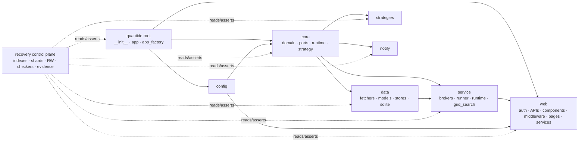

# Millionaire Coverage Recovery — Architecture Design

- **Spec ID**: `v0.2-004-coverage-recovery`
- **阶段**: M-ARCH
- **实现基线**: Python `>=3.13,<4.0`、Poetry、pytest；继承 v0.2-001/002/003 已锁定业务合同
- **设计目标**: Devon 可按 169 个生产路径与 196 个 `RW-*` 独立实施；Shield 可按稳定命令与证据出口独立验证
- **非目标**: 不新增业务行为，不重写 spec/acceptance/test-plan，不授权删除，不降低阈值，不创建 generic waiver

## 1. 范围与完成定义

本轮是覆盖率恢复架构，不是业务重构。唯一生产范围是固定 inventory 中的 169 个 `quantide/**/*.py` 路径；恢复控制面位于测试与 `.louke` 证据目录，不进入 `quantide/`。完成必须来自同一 revision、同一次全绿完整 unit invocation：pytest exit 0、0 failed/errors、overall statement/line `>95.0`、35 个 v0.2-added 可执行文件逐文件 `>=95.0`、retained pre-v0.2 可执行文件逐文件 `>=80.0`、manifest 等式成立、196 个 RW 全闭合、反作弊与 waiver 校验通过、closure blockers 为 0。

| 规范范围 | 数量 | 架构出口 |
|---|---:|---|
| 新 recovery FR | 10（FR-1001..FR-1901） | hash reader、inventory/outlet、RW、closure、evidence gate |
| 新 recovery NFR | 4（NFR-1001..NFR-1301） | coverage、反作弊、隔离、可重放证据 |
| Acceptance | 64（52 FR AC + 12 NFR AC，满足 58+） | `interfaces.md` §12 的 AC outlet map |
| 生产路径 | 169/169 | corrected shard 合同 + batch row + AC outlet |
| 测试函数 | 1651 | 1455 aligned + 196 update + 0 needs-Sage-contract |
| Devon 工作 | 196 | 每个 update function 恰好绑定一个 open `RW-*` |
| Aaron 决定 | 6/6 | `RESOLVED RETAIN`、当前实现合同、无 waiver |

## 2. FR family 边界与编号调和

| Family | 责任边界 | 不负责 | 主要出口 |
|---|---|---|---|
| FR-1001 | disk/inventory/coverage 三集合等式；169 个 path outlet | 行为语义判定 | manifest equality report |
| FR-1101 | 分类、来源、消费证据与决定权限 | coverage 百分比 | classification report |
| FR-1201 | 从 13 个 corrected shards 重建逐路径 source-grounded 合同 | 以测试或实现反向改写合同 | contract reconstruction report |
| FR-1301 | 测试质量复核与 defect attribution | 把静态 aligned 当运行通过 | quality/attribution report |
| FR-1401 | Red→Green→same-revision full-suite 的修复闭环 | issue 数替代 DoD | RW evidence links |
| FR-1501 | AD-01..AD-06 的 Aaron `RESOLVED RETAIN` 决定 | 删除、waiver、行为升级 | six-row decision report |
| FR-1601 | 完整 `tests/**/*.py` 双向 AC trace 与删除五证据 | 文件名推断、generic mapping | trace matrix |
| FR-1701 | blocker 并集驱动下一轮，直至 0 | 有限 issue 列表耗尽即停止 | closure matrix/summary |
| FR-1801 | 文件特定临时 waiver 验证；当前 registry 为空 | generic/v0.2-added waiver | waiver validation |
| FR-1901 | 汇聚全部信号形成唯一 PASS/FAIL | 单个 coverage artifact 替代证据包 | binary verdict |
| NFR-1001 | overall `>95` 与 95/80 分档阈值 | 降级或跨 run 拼接 | coverage/per-file report |
| NFR-1101 | 有意义断言与 anti-pattern guards | import-only、self-fulfilling、mock SUT | guard report |
| NFR-1201 | HOME/config/data 隔离、确定性、subprocess 与资源清理 | 真实网络依赖 | isolation/cleanup report |
| NFR-1301 | 同 revision 可重放 evidence package | 人工摘要替代原始 artifact | hashes + provenance |

### 2.1 FR-08xx story 结构调和

| Story/历史标签 | 本 spec 的规范落点 | 架构解释 |
|---|---|---|
| FR-0801 audit | FR-1001 + FR-1101 + FR-1201 | audit 已扩展为全 169 路径、分类和 source-grounded 合同；`FR-0801` 仅作为 story/测试计划兼容标签，不创建碰撞 AC |
| FR-0802 v0.2-added `>=95%` | NFR-1001 + FR-1901 | 35 个 v0.2-added 路径按 inventory origin 分档且无 waiver；同次全绿证据才有效 |
| FR-0803 豁免升级流程 | FR-1801 | 文件特定临时 waiver 验证；当前 registry 为空；schema `coverage-waivers/v1` 由 interfaces.md §8 强制 |
| “FR-1801 RETAIN test-direction” | FR-1501 + FR-1801 | RETAIN 决定与当前实现 test-direction 归 FR-1501；FR-1801 只验证 waiver。六个 RETAIN 文件未获 waiver，因此两者共同要求保留、测试、逐文件 `>=80%` |
| FR-1501 RESOLVED Aaron decisions | FR-1501 AC-01..09 | 6/6 `RETAIN`；corrected shard 是行为正文，`aaron-decisions.md` 是决定与测试义务 |
| FR-1101/1201/1301/1401/1601/1701 | 同号规范 family | 依次形成 classify → contract → inspect → repair → trace → iterate 的闭环 |

## 模块划分

### 3.1 生产模块 family topology

| Production family | 边界 | 允许的依赖方向 | 对外可观察面 |
|---|---|---|---|
| `quantide` root | app composition、factory、package facade | config/core/data/service/web | import surface、app route composition、启动失败 |
| `quantide/core` | DTO、ports、clock/runtime、strategy/risk/message | 标准库与明确 adapter ports；不得反向依赖 web | Python public API、event/message、异常、资源 lifecycle |
| `quantide/data` | fetcher、model、SQLite/Parquet store、resampling | core contracts、外部 SDK boundary | schema、查询/写入结果、文件/DB 状态、异常/fallback |
| `quantide/service` | broker、runner、strategy runtime、grid search、metrics | core + data；通过 port 接外部系统 | 返回/异常、event、持久化、worker/subprocess lifecycle |
| `quantide/notify` | mail/DingTalk 与遗留 market helper | SMTP/HTTP boundary、core data | envelope/request、返回/错误、市场 helper 输出 |
| `quantide/strategies` | 内置策略行为 | core ports，不直接接真实 gateway | order/risk action 与边界结果 |
| `quantide/web` | FastHTML auth、middleware、pages、APIs、services | service/data/core；不被 core 反向依赖 | HTTP status/header/body/redirect、SSE、session/persistence |

### 3.2 依赖规则

1. 测试替身只放在外部边界：clock/random、filesystem、SQLite/Parquet、HTTP/websocket、SMTP/Tushare/gateway、scheduler/process；禁止替换被测主体。
2. recovery readers 只读固定 JSON/Markdown 与 `coverage.json`，不 import `quantide` 来生成 expected value。
3. checker 调用方向固定为 pytest → coverage JSON → hash/manifest/per-file/waiver/trace/closure → evidence package；后置 checker 不得修改或重新合并 coverage 数据。
4. `grid_search` 的进程内主控与 worker 均由 coverage.py subprocess protocol 采集；不得 monkeypatch pool 为同步调用来制造覆盖率。
5. web 测试通过 HTTP/FastHTML 可观察结果与隔离 services 断言；core/data/service 测试优先 public Python API 与持久化后果。

## 4. Recovery artifact layout（生产代码之外）

| 路径 | 所有者/写入者 | 角色 | 不变量 |
|---|---|---|---|
| `.louke/project/specs/v0.2-004-coverage-recovery/recovery/production-file-inventory.json` | Sage 固定；reader 只读 | production index | exact SHA-256 `8410d32f...bfbe`、13 shards、169 records |
| `recovery/production-contracts/*.json` | Sage 固定；reader 只读 | path-keyed normative contracts | manifest SHA-256 `4ec8dbdb...fbe`；169 source-grounded，0 pseudo API/mangled/missing anchor |
| `recovery/test-trace-data.json` | Sage 固定；trace updater 经 review | test index | exact SHA-256 `3d7ebc07...8fd0`、11 shards、240 modules/1651 functions |
| `recovery/test-trace/*.json` | Sage 固定；trace updater 经 review | function trace shards | manifest SHA-256 `f48b15e8...0352`；1455 aligned/196 update |
| `recovery/devon-work-items.json` | Devon registry writer | normative M-DEV queue/status/evidence links | pinned input SHA-256 `bac42a69...088`；196 unique RW/function one-to-one |
| `recovery/aaron-decisions.md` | Aaron/Sage 固定；reader 只读 | AD-01..06 decision source | 6/6 RESOLVED RETAIN、current implementation、no waiver |
| `recovery/coverage-closure.json` | closure writer | per-path blocker matrix | 169 rows；每轮重算；最终 blockers=0 |
| `coverage-waivers.json` | Aaron-approved registry writer | file-specific temporary waivers | 当前 `waivers=[]`；v0.2-added 永不合法 |
| `tests/unit/_checkers/` | Devon | deterministic CLI readers/checkers/writers | 标准命令见 `interfaces.md`；自身有正反例 unit tests |
| `coverage.json`, `htmlcov/` | pytest-cov | accepted run raw output | 仅 pytest exit 0 后 hash-pin；失败 run 标 diagnostic |
| `artifacts/coverage-recovery/<run_id>/` | evidence-package writer | M-MILESTONE evidence package | immutable files + canonical manifest + SHA-256 |

### 4.1 Devon RW registry 状态模型

状态只允许 `open → closed` 或 `open → superseded`。`closed` 必须附同一 function/AC 的 AC-derived Red、独立 assertion Green、同 revision canonical full-suite 和 per-file gate 证据。`superseded` 必须双向链接 replacement，并完整继承 function id、AC refs 与 evidence obligations。任何批量关闭、issue 状态投影或缺证据状态变化均拒绝写入。

## 5. AC outlet map

| AC family | 数量 | Interface exit | Test-plan coverage |
|---|---:|---|---|
| AC-FR1001 | 4 | source-manifest equality + production hash reader | §4 FR-1001；§6 B01..B13；§7.2 |
| AC-FR1101 | 4 | classification report | §4 FR-1101；§5；§6 batches |
| AC-FR1201 | 7 | corrected-shard reconstruction report | §3 Ground Truth；§4 FR-1201；§6.6 |
| AC-FR1301 | 6 | quality/attribution + RW binding report | §1 anti-pattern；§4 FR-1301；§6.4 |
| AC-FR1401 | 4 | RW registry write result + R/G/F links | §6.2/6.4；§7.1 |
| AC-FR1501 | 9 | Aaron six-row decision/read report + coverage rows | §6.5 |
| AC-FR1601 | 8 | test trace hash reader + `lk agent archer ci-scan` | §1.4；§4 FR-1601；§7.2 |
| AC-FR1701 | 3 | closure matrix/summary | §7.1/7.4 |
| AC-FR1801 | 4 | waiver validator | §4 FR-1801；§5；§7.3 |
| AC-FR1901 | 3 | evidence verifier binary verdict | §4/5；§7.3/7.4 |
| AC-NFR1001 | 4 | accepted `coverage.json` + per-file report | §2.3；§5；§7.3 |
| AC-NFR1101 | 3 | AST/diff anti-pattern report | §1.3/1.4；§7.2 |
| AC-NFR1201 | 3 | isolation/determinism/cleanup reports | §2.2/2.4/2.5；§7.2 |
| AC-NFR1301 | 2 | evidence package manifest/verifier | §7.4 |

每个 production row 的 outlet 不是抽样：path 主键连接 corrected contract、FR-1001/1101/1201/1301/1401/1601/1701/1901、NFR-1001/1101/1201/1301 以及 B01..B13 shard row；有 Aaron candidate 的行再连接 FR-1501，有合法 waiver 时再连接 FR-1801。

## 6. 测试与 gate 架构

| 层 | 边界 | 必须验证 | 不可替代物 |
|---|---|---|---|
| Unit | pure API、DTO、renderer、policy、helper | 正常 + 适用失败/边界；独立 oracle | import-only/coverage-only invocation |
| Integration | SQLite/Parquet、HTTP adapter、MessageHub、scheduler、process | I/O 后果、protocol request、cleanup、failure fallback | 真实网络/真实用户 HOME |
| Recovery gate | full `tests/unit` + deterministic readers | same-run coverage、hashes、manifest、trace、RW、waiver、closure | 子集 Green、失败 run coverage |
| E2E/contract review | 既有 `tests/e2e` 中的 bound functions 与 HTTP journeys | 隔离 Green 与 trace；最终 coverage 仍取 canonical unit run | 浏览器/视觉/真实服务新增门禁 |

### 6.1 Canonical stack

| 技术 | 版本/配置 | 解决的问题 | 放弃的替代 | 主要风险/控制 |
|---|---|---|---|---|
| Python | `>=3.13,<4.0` | 与当前项目/runtime 对齐 | 多 Python matrix | 依赖兼容；Poetry lock + CI 固定版本 |
| pytest | `>=9.0.2,<10.0.0` | canonical runner、fixture/collection | unittest/tox 作为主入口 | plugin compatibility；unknown option 直接阻断 |
| pytest-cov | `>=7.0.0,<8.0.0` | same-run coverage 与 JSON/HTML | 独立 `coverage run` 后拼接 | subprocess 丢数据；启用 coverage subprocess protocol |
| coverage.py | pytest-cov transitive compatible version；branch=true | source manifest、per-file summaries | 手工行计数 | 配置漂移；hash/config diff guard |
| pytest-timeout | `>=2.4.0,<3.0.0` | hang fail-fast 与 faulthandler 诊断 | shell-only timeout | 慢机误报；60s test timeout + 90s stack dump |
| pytest-asyncio | `>=1.3.0,<2.0.0`，auto | async lifecycle | 自建 event-loop harness | task leak；teardown leak guard |
| freezegun | `>=1.5.5,<2.0.0` | deterministic wall clock | sleep/真实时间 | patch 范围；优先显式 clock port |
| stdlib JSON/hashlib/pathlib | Python 3.13 | deterministic recovery readers/writers | 新增 schema/hash 库 | canonicalization 分歧；interfaces 固定 exact-bytes/canonical JSON 规则 |
| `lk agent archer ci-scan` | 当前 Louke runtime | AC 双向 closure/anti-pattern scan | deprecated top-level agent 命令 | Louke #118 前 required-check 不可查询；package 记录 pending signal |

不新增运行时依赖。项目许可证为 MIT；上述测试依赖沿用 `pyproject.toml`，本设计不引入不活跃或不稳定第三方库。文档沿用 Markdown/MkDocs，lint 沿用 Ruff `>=0.11.0,<1.0.0` 与 mypy `>=1.19.1,<2.0.0`；本轮不修改配置。

### 6.2 subprocess coverage

`COVERAGE_PROCESS_START=pyproject.toml` 由 canonical invocation 环境传入；coverage run 配置在实现阶段增加兼容 coverage.py 版本的 multiprocessing/subprocess collection 设置，worker 退出时写 `.coverage.*`，pytest-cov 在同一 invocation 内合并后才生成 `coverage.json`。验证必须证明 `quantide/service/grid_search.py` worker 已知行被归属且进程池无残留；同步 monkeypatch 不满足该出口。

### 6.3 source manifest 与 per-file policy

disk 枚举、固定 inventory path 和 `coverage.json.files` 规范化后必须三集合相等且均为 169。`num_statements==0` 仅跳过百分比比较，不跳过 manifest/classification/contract。v0.2-added executable 为 `>=95.0` 且不可 waiver；retained pre-v0.2 executable 为 `>=80.0`，仅接受 Aaron 文件特定、未过期、完整字段 waiver；overall 必须严格 `>95.0`，恰好 95.0 失败。

### 6.4 anti-pattern guards

AST + diff + review 联合拦截 `assert True`、空 `pass`、import-only、self-fulfilling expected、mock SUT、无断言 mock、吞异常、无 issue skip、扩大 omit/exclude、批量 `pragma: no cover`、阈值下降、删除有效行为提数字。guard 通过只是必要条件，不替代行为 Green。

## 7. 关键架构决策与权衡

| 决策 | 收益 | 放弃 | 风险与缓解 |
|---|---|---|---|
| 固定 index + sharded contracts | 169 行可审计且文件规模可控 | 单一巨型 JSON、运行时 AST 猜合同 | index/shard 漂移；exact/canonical hash 双校验 |
| 复用并扩展现有 per-file checker | 一个不可绕过 gate | 新建平行 checker | 旧 checker 当前不足；contract tests 先锁定严格 `>95`、95/80、waiver、manifest |
| RW function 一对一 registry | 每个测试缺陷有独立 closure | 模块级 TODO/issue 列表 | registry 写坏；原子写、schema、唯一性与 hash verification |
| same-run immutable coverage | 防止跨 run 拼接与失败 run 洗白 | 独立 fastest shards 合并为验收 | 运行成本；batch 仅诊断，最终一次 canonical run |
| stdlib deterministic artifact tooling | 无新依赖/许可面 | JSON Schema 第三方 validator | 手写规则遗漏；正反例 contract tests + Prism review |
| RETAIN current-implementation characterization | 遵守 Aaron 已决定边界 | 删除或产品化 legacy 行为 | 偶然行为被升级；仅 corrected shard public surface 可断言 |
| blocker-driven iterative closure | 任一 DoD 缺口都会继续生成工作 | issue list 清空即完成 | 循环无界；每轮 deterministic blocker diff，只有 0 才停止 |

## 8. M-MILESTONE evidence package 与 gate

M-MILESTONE 不得仅凭 CI 绿色标记关闭。evidence writer 必须在 `artifacts/coverage-recovery/<run_id>/` 写 immutable package；verifier 对同一 commit/run 重算并给出唯一 verdict。

| Required evidence | 必填内容 | 阻断条件 |
|---|---|---|
| `run.json` | run_id、commit SHA、dirty flag、UTC、Python/tool versions、canonical command/env、pytest exit/summary | 非同 revision、字段空、pytest 非 0 |
| `coverage.json` + `coverage.sha256` | pytest-cov 原始 JSON、exit 0 后立即计算 hash | hash 不符、overall `<=95.0`、来自 failed run |
| `source-manifest.json` | disk/inventory/coverage 三集合、count、diff、inventory/shard pins | 非 169/169/169 或任一差集非空 |
| `per-file-coverage.json` | 169 行 path/origin/statements/covered/percent/target/waiver/status | 任一适用行 below target 或缺行 |
| `waiver-validation.json` | registry hash、逐条结果、当前 empty 状态 | generic/invalid/expired/v0.2-added waiver |
| `trace-matrix.json` | 64 AC 双向 trace、1651 functions、196 update/RW 状态、pins | orphan、重复 binding、open/invalid RW |
| `anti-patterns.json` | AST/diff/config guards 与 findings | blocking finding 非零 |
| `aaron-decisions.json` | 6/6 RETAIN、shard record、R/G/F、per-file result | 任一非 RETAIN/缺证据/<80 |
| `closure-summary.json` | 每类 blocker count、iteration、唯一 PASS/FAIL | blocker 非 0 或 verdict 非 PASS |
| `manifest.json` | package schema、每个相对路径的 bytes/sha256、run/commit | 漏文件、重复路径、hash 不符 |
| required-check evidence | Louke issue #118 可用后：required check name/conclusion/SHA/URL | 缺 check、非 success、SHA 不同 |

M-MILESTONE gate 的逻辑是上述信号的 AND：same-run full-suite、coverage、manifest equality、per-file、waivers、trace matrix、Aaron decisions、anti-patterns、closure summary、package hashes、required-check（#118 ships 后）全部通过才可关闭。

## 9. 六项一致性检查（由 gate 执行，不在 M-ARCH 运行测试）

| # | 必须结果 | 证明 artifact |
|---:|---|---|
| 1 | spec ↔ acceptance：10/10 FR、4/4 NFR、64/64 AC，coverage 100% | `spec.md`、`acceptance.md`、AC namespace/outlet report |
| 2 | acceptance ↔ production inventory：169/169 paths 均有 AC outlets 与 shard rows | production index、13 production shards、outlet report |
| 3 | test-plan ↔ production inventory：B01..B13 共 169/169 path，0 duplicate/missing/extra | `test-plan.md` §6.3、production index |
| 4 | test-plan ↔ RW registry：RW-0001..RW-0196 共 196/196，每项只出现一次并一对一绑定 update function | `test-plan.md` §6.4、`devon-work-items.json`、test trace shards |
| 5 | recovery artifacts hash-pinned：production index+manifest、test index+manifest、RW registry 五个 pin 全匹配 | package `source-manifest.json`、`trace-matrix.json`、固定 recovery files |
| 6 | Aaron decisions：6/6 `RESOLVED RETAIN`，当前实现合同、无删除/waiver | `aaron-decisions.md`、FR-1501 report、empty `coverage-waivers.json` |

## 10. 实施交接

- Devon 从 fixed corrected contract 与 RW registry 读取工作，不从本架构 prose 猜业务语义；按 B01..B13 依赖顺序修复，并为 checker/writer 建立正反例 contract tests。
- Shield 从 `interfaces.md` 的命令、schemas、exit codes 与 evidence package 断言，不发明环境、数据或豁免；既有 e2e bound function 需保存隔离 Green，但 milestone coverage 只接受 canonical full unit run。
- 任一固定 artifact 变化必须先形成新版本与同步 spec/acceptance review；不得静默刷新 hash。
