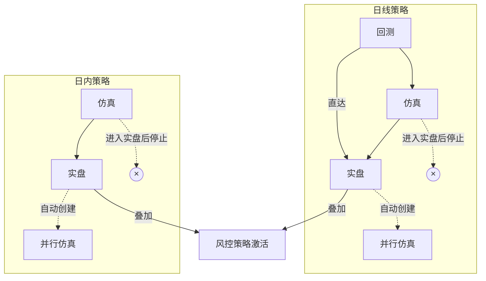

Millionaire 是Quantide量化策略开发框架系列中的大众版。它适合独立量化开发者使用，具有使用成本低（个人电脑 + 年均200元以下数据使用费）、易上手（策略一次开发、自动适应回测、仿真、实盘）和可扩展特点（支持自定义策略）。

Billionaire 是它的升级版，具有内建因子库、因子存储库和分钟级回测等功能。

Zillionaire 是面向专业量化机构的版本，它采用完全不同的高性能、跨网络存储方案，可以同时支持多名研究员同时开发、运行策略，并具有更好的可维护性（多节点、容器化微服务架构）。

Billionaire/Zillionaire 不在仓库实现范围内。以下内容均如非特别说明，特指 Millionaire版本。

## 1. 策略框架

Millionaire 通过适配外部数据源，提供统一的历史数据和实时数据访问接口。历史数据只支持日线级别；实时数据仅当天可获得。Millionaire 策略有回测、仿真和实盘三种运行模式。基于上述能力和运行模式，Millionaire 策略主要分为两类，下表列出了两类策略的主要异同：

| 能力维度      |    独立策略    |       风控策略       | 差异根因         |
| ------------- | :------------: | :------------------: | ---------------- |
| 独立资金账户  |       ✅        |          ❌           | 划分轴           |
| 持仓归属      |      自己      |         宿主         | 账户有无         |
| 买入/卖出能力 |     ✅ / ✅      |    ❌ / sell_host     | 账户有无         |
| 收益闭环      |   卖出即确定   |     卖出后才开始     | 有无账户         |
| 回测方法      |  资金循环模拟  |  **随机持仓**+超额   | 收益范式         |
| 评估指标      |    8 项完整    |    超额+触发统计     | 收益范式         |
| 调度独立性    |   可独立运行   |       跟随宿主       | 没账户           |
| 宿主绑定      |       无       |      创建时绑定      | 只卖不买         |
| 驱动契约      |    `on_bar`    |      `on_check`      | 触发方式         |
| 多实例共存    | ✅ 多策略可并行 | ✅ 多风控可绑同一宿主 | 两者都支持多实例 |

**风控策略在回测**时，将每日随机生成一批（参数）个股，次日风控策略生效，决定是否卖出：对卖出的个股，按 Triple Barrier 方法计算 n 日（参数）卖出时的超额收益；对没卖出的个股则直接抛弃。当日再随机生成另一批个股，供第风控策略第二天消耗。

### 1.1. 作为SDK

策略框架要能以 SDK 的方式暴露出来，使得开发者可以在自己习惯的 IDE 中使用，并支持 AI Coding Agent 开发模式: 通过 skill 暴露出数据、交易接口，生成策略模板。

<!-- (1) API 类型标注完备，Agent 可自动理解接口；(2) 提供策略模板/脚手架，Agent 可从模板生成策略代码；(3) 策略开发约定（命名、目录结构、基类继承）以结构化形式记录，可被 Agent 消费。 -->

### 1.2. 自动发现

依据本框架开发的策略，在指定位置（可配置）可以被 Millionaire 扫描，从而列出所有策略，包括它们的名称、描述和参数。

<!-- 建议策略通过 `default_config()` 类方法返回 dict 声明参数（key=参数名, value=默认值）。扫描时框架读取此方法以获得参数列表和默认值，供 UI 展示和 Agent 调用。 -->

### 1.3. 策略参数

允许用户在回测启动时指定策略参数。在回测转实盘/仿真时，回测时使用的参数将带入实盘/仿真，不允许修改。

### 1.4. 无感迁移

依据本框架开发的策略，可以无需修改代码，即可以回测、仿真、实盘方式运行。

### 1.5. 下单方式和成交规则

Millionaire 支持三种下单和撮合方式：

| 模式           | 回测                                         | 仿真                                                                     | 实盘                                   |
| -------------- | -------------------------------------------- | ------------------------------------------------------------------------ | -------------------------------------- |
| Cheat-on-Close | 收盘价成交                                   | 尾盘前（t0）执行，立即委托 [t0,收盘]区间匹配价格，全部成交            | 同仿真，但成交量取决于市场             |
| 正常模式       | 开盘价成交，但遇涨跌停则不成交               | 集合竞价委托，涨停买入，跌停卖出 开盘价量价匹配成交，但遇涨跌停不成交 | 同仿真，但成交量（含涨跌停）取决于市场 |
| 限价单         | 价格在[low,high]之间 则按指定价格全部成交 | 集合竞价委托，按 tick数据，量价匹配成交                                  | 同仿真                                 |

<!-- 支持按股数、按金额、按持仓比例下单-->

### 1.6. 独立策略

独立策略自己选股交易，有自己的资金账户，独立计算收益。

### 1.7. 双均线策略

双均线策略是 Millionaire 的内建策略，起到演示独立策略用法的作用。

该策略使用内建数据接口，获得日线行情数据，计算[fast, slow]两个不同周期的均线，并在快线上穿慢线时发出买入信号，在慢线上穿快线时发出卖出信号。回测完毕后，计算常用回测指标并以图形化方式展示净值、参考线、买入点、卖出点和均线指标。根据策略执行时间和成交方式，有以下几种主要模式：

| 模式  | cheat-on-close                                     | 次日开盘                                         | 次日限价                                       |
| ----- | -------------------------------------------------- | ------------------------------------------------ | ---------------------------------------------- |
| 回测  | T0收盘价信号，T0收盘价撮合                         | T0收盘价信号，T1开盘价成交                       | T0收盘价信号，T1限价成交                       |
| paper | T0尾盘信号，实时或者竞价成交 尾盘运行，即时委托 | T0收盘价信号，T1开盘价成交 盘后运行，次日委托 | T0收盘价信号，T1限价成交 盘后运行，次日委托 |
| live  | T0尾盘信号，实时或者竞价成交 尾盘运行，即时委托 | T0收盘价信号，T1开盘价成交 盘后运行，次日委托 | T0收盘价信号，T1限价成交 盘后运行，次日委托 |

双均线策略是 Millionaire 内置策略。

<!-- 回测时因为自带未来视角，所以没有所谓的策略『运行时刻』，on_bar 拿到收盘价即可立即撮合并成交。-->

### 1.8. 30分钟隔夜策略

Millionaire 不内置本策略，最终用户需要自行编写；但策略框架必须**有能力**支持本策略在仿真和实盘阶段运行（因数据原因不支持回测）。

**30分钟隔夜策略** 该策略的算法是，每天筛选出前一天强势股，在尾盘时，如果30分钟均线均朝上，则发出买入信号。该策略执行时，需要每天在 day_open 时进行选股，并使用30分钟和日线数据，因此无法在 Millionaire 中回测。

**本策略的驱动契约**：

1. 通过框架提供的统一生命周期和数据 API 获取数据、发出交易信号，不直接访问 qmt-gateway 的原始接口。
2. 至少支持 `on_day_open` 和 `on_bar` 两类驱动；其中 `on_bar` 可对应 30m、1d 等框架已定义的周期。
3. 30 分钟线等非原始数据由框架基于实时行情聚合后提供给策略，策略侧只消费标准化后的 bar 数据。
4. 若某类实时策略确实需要 tick 级驱动，则该能力由后续 spec 明确为框架级回调或等价机制；在 story 层只要求它只能运行于 paper/live，不要求回测兼容。

### 1.9. 风控策略

风控策略没有自己的独立资金账户。它监控其它策略的持仓，按自己的逻辑决定是否要卖出。风控策略只统计超额收益，不统计其它指标。风控策略可以随时停止和重新启动。

以下是超额收益的计算方法。

使用Triple Barrier 方法来计算本策略的收益。从持仓卖出之日（`T0`）起，监控`n`日，直到满足以下条件之一，结束监控，计算超额收益：

1. 价格上涨到 $P_{sell} * (1 + up\_threshold)$，超额收益为 $-1 * up\_threshold$
2. 价格下跌到 $P_{sell} * (1 - down\_threshold)$， 超额收益为 $down_threshold$
3. 直到 T_n 日，上述条件均未满足，收盘价卖出，超额收益为 $P_{sell} / Close_n - 1$

在日线回测时，使用当日最高价和最低价来判断是否满足停止条件。如果一日内，两停止条件同时满足，则以开盘价最近者为准。即，如果开盘价更接近上屏障，则属于条件1退出；反之，如果开盘价更接近于下屏障，则属于条件2退出。

在仿真和实盘时，以 last_price 先到者为准。

以下是风控策略的例子。

### 1.10. 回落卖出（风控）策略

该策略的算法是，当个股价格当天上涨至 m% 后，如果在 n 分钟内下跌超过 k%，则立即卖出。执行该策略需要 tick 级数据。本策略是内置策略。

### 1.11. 成本止损（风控）策略

该策略的算法是，对持仓个股，如果跌破买入价的 k%，则立即卖出。本策略是内置策略。

### 1.12. 交易规则

Millionaire 在框架层统一实施 A 股交易规则，策略代码无需感知。回测、仿真、实盘三种模式下规则一致，仅撮合成交方式有所不同，请参见§1.5。

1. 涨跌停限制：以数据中的 `up_limit` / `down_limit` 字段为准，框架不内置规则。
2. 买入数量必须是 100 股的整数倍。框架在下单前自动向下取整（不足 100 股的部分丢弃）；取整后为 0 时下单失败。
3. 卖出数量一般也须为 100 的整数倍，但清仓（卖出全部可用持仓）时不受限制。
4. **T+1**：当日买入的持仓，当日不可卖出；次日起方可卖出。框架按"可卖持仓"和"在途持仓"分别记账。
5. **停牌**：停牌股票（数据缺失或 volume=0）不可下单；持仓中的停牌股票按停牌前最后收盘价估值。
6. **ST**：`is_st=true` 的股票不做下单限制，但策略可基于该字段自行过滤。
7. 卖出回款当日可用于继续买入（A 股现金账户规则）。
8. 印花税（卖方收取，按比率）、佣金（按比率，但不低于单笔最低佣金）按 §1.13 配置扣除，扣减发生在成交后立即结算。
9. 资金校验在虚拟账户层进行：买入下单时检查虚拟账户可用资金是否足以覆盖（成交金额 + 佣金）。

**回测与实盘的差异**

回测时上述规则全部由框架仿真实施；仿真和实盘时，时间规则、价格规则、数量规则由交易所/柜台强制保证，框架只在下单前做预校验以避免明显错误的委托被发出。回测与实盘的撮合差异已在 §1.5 中说明。

### 1.13. 运行时参数

除策略自身声明的参数外，每次启动回测/仿真/实盘时，用户都需要指定以下运行时参数，由框架统一管理，策略代码不可见：

- **本金**：实盘/仿真时作为虚拟账户资金上限（见 §2），回测时为初始资金。
- **滑点**：比率，作用于撮合价格。
- **手续费**：包含印花税比率（卖出时收取）、佣金比率、单笔最低佣金（绝对值）三部分。

与策略参数不同，运行时参数在每次切换运行模式（回测 → 仿真 → 实盘）时都允许重设（见 §2.5），不被回测结果锁定。

## 2. 策略调度

每个独立策略在live/paper中运行时，将拥有一个虚拟账户，单独配置本金作为资金上限。所有虚拟账户共享实盘真实账户的总资金，用户自行保证各策略本金之和不超过真实账户可用资金，Millionaire 不做跨虚拟账户的资金分配校验。

在 live 模式下，真实柜台负责最终成交执行；Millionaire 则为每个独立策略维护按策略ID归因的虚拟账本，用于策略级资产、持仓、委托、成交、收益评估、dry-run 和并行仿真的展示与统计。除非特别说明，系统中的“策略账户”均指这套虚拟账本，而不是柜台原始总账户。

手工交易、补单和风控卖出都必须归属到某个独立策略账户，并写入该策略的虚拟账本；柜台原始账户信息主要用于总览和排障，不直接替代策略级归因结果。

独立策略按所要求的数据粒度，又可分为日线策略，和日内策略。

### 2.1. 日线策略

日线策略在 Millionaire 中，具有完整的回测支持。因此，日线策略必须从回测开始，才能进入仿真和实盘（使用该回测的参数）。回测完成后有两条路径：

1. **顺序路径**：回测 → 仿真 → 实盘。
2. **直达实盘**：回测 → 实盘。

策略允许多次运行回测。每个策略，最多保留30个回测结果。用户可以对这些回测结果进行查询和管理。

进入实盘后，原仿真（如果有的话）当日停止运行，创建新的仿真，与实盘并行运行。

### 2.2. 日内策略

日内策略在 Millionaire 中，因缺少历史数据，故无法回测，调度路径为：仿真 → 实盘，或直接启动实盘。

进入实盘后，原仿真（如果有的话）当日停止，同样自动创建一个并行仿真。

### 2.3. 风控策略

风控策略没有独立的调度路径，它跟随所叠加的独立策略的生命周期。当独立策略进入 paper 或 live 时，其关联的风控策略自动激活。

### 2.4. 调度总览

## 3. 数据源与存储

### 3.1. 行情数据
- 日线（个股、指数）：核心历史数据。字段：OHLCV + amount + adjust + is_st + up_limit + down_limit。Parquet 存储，按年分区。数据源：tushare。
- tick、分钟线、30分钟线：仅 live/paper 模式下的实时数据，只缓存当天，不做持久化。

### 3.2. 参考数据
- 交易日历：所有交易所的交易日和非交易日。数据源：tushare。
- 证券列表：全市场股票代码、名称、拼音、上市/退市日期。数据源：tushare。
- is_st：特别处理标记（ST / *ST）。数据源：tushare。

### 3.3. 复权与涨跌停
- adjust（复权因子）：用于前复权/后复权计算。数据源：tushare。
- 涨跌停价：A 股特有，用于撮合判断和限价单比较。数据源：tushare。

### 3.4. 实时行情
- qmt：通过 qmt-gateway 获取实时 tick 和分钟线。仅 live/paper 模式使用。

### 3.5. 数据同步
 - 定时执行日线行情数据、证券列表、交易日历、st、涨跌停历史数据的同步。
 - 盘前获取当日涨跌停价格、复权因子获取
 - 定时任务可配置，运行有报告跟踪，错误在 UI 上报告
 - 任务错过执行（错误纠正后）重新执行
 - 数据补录

### 3.6. 数据完整性校验及报告
后台任务，定时执行数据完整性校验，并在 UI 上报告错误。

### 3.7. 数据查询支持
- 支持用户查询交易日历
- 支持用户按名字、数字和拼音模糊查询个股基本信息
- 支持用户查询个股历史行情并绘制 k 线图

## 4. 策略评估与可视化

### 4.1. 回测评估指标（日线策略）
仅日线策略支持回测，指标如下：
- 年化收益率
- 最大回撤
- Sharpe 比率
- Sortino 比率
- Calma 比率
- 胜率
- 盈亏比
- 交易次数
- 基准对比（如沪深 300，用于判断策略 alpha）

### 4.2. 实盘/仿真评估指标
日线策略和实时策略在实盘/仿真运行时，使用与上一节相同的指标进行评估。数据来源为实盘/仿真的实际成交记录。

### 4.3. 风控策略评估
风控策略无独立资金账户，不计算传统收益指标。仅评估：
- **超额收益**：按 §1.9 定义计算
- 风控触发次数及触发原因统计

### 4.4. 可视化
Millionaire 使用 FastHTML 构建 Web 界面，可做响应式可视化。

核心图表如下：
- 资金曲线（含基准对比线）
- 回撤图
- 交易标注（买入/卖出点标记在 K 线上）
- 月度收益热力图

以上图表适用于日线策略和实时策略。风控策略仅展示超额收益曲线。

### 4.5. 回测进度可视化

策略在回测时，需要在界面实时更新进度。该界面应该以回测区间为 x 轴，根据 on_bar 进度，逐点绘制策略以及参照标的的净值变化对比图，实时更新回测指标（只有在回测结束时才能计算的除外）及交易标注。

## 5. 账户管理

系统支持多策略同时运行，每个日线策略和实时策略拥有独立资金账户（虚拟账户）。风控策略无独立账户，其交易归属宿主策略账户。

### 5.1. 账户总览
- 汇总展示所有运行中策略的账户基本信息（总资产、可用现金、持仓市值、账户盈亏）
- 支持按策略筛选，查看单策略账户详情

### 5.2. 委托和成交记录

- 支持列出三态（回测、paper、live）下的委托记录，按策略、个股、时间段进行查询
- 支持列出三态（回测、paper、live）下的成交记录，按策略、个股、时间段进行查询

### 5.3. paper/live 账户
- 每日收益率查询及净值曲线（可视化）
- 月度收益热力图
- 支持查询最大(n)亏损、最大(m)盈利个股
- paper/live 的账户基本信息（总资产、可用现金、持仓市值、账户盈亏）

## 6. 实盘交易界面

界面顶部提供**策略选择器**，列出当前所有实盘运行的策略（日线策略 + 实时策略），用户可切换查看不同策略的信息。

1. 显示所选策略的账户基本信息
2. 显示所选策略的当日委托、成交并实时刷新
3. 提供基础交易界面，允许用户在紧急情况下手动交易。
4. 手动交易必须归属一个目标策略（虚拟账户）；风控策略不可作为手动交易目标。

## 7. 仿真交易界面

界面顶部提供**策略选择器**，列出当前所有仿真运行的策略，用户可切换查看不同策略的信息。

在该界面下：
1. 显示所选策略的账户基本信息
2. 显示所选策略的当日委托、成交并实时刷新
3. 提供交易界面，供用户补单（防止自动化失败的补救措施）

## 8. dry-run 模式
允许正在实盘的策略进入 dry-run 模式，此模式下，策略正常运行，但并不会下委托。期间交易信号会被记录，但策略指标无法计算。dry-run 期间的策略指标参考其并行仿真实例。

<!-- 实盘交易信号发出后，能否成交、成交量是多少无法估计，即使开启仿真也无法做到重现；为降低实现难度，我们要求同一策略，在进入实盘时，同时开启仿真 -->

## 9. 消息通知

用户需要在以下事件发生时，收到微信通知：

1. 委托和成交
2. 委托和成交失败
3. 实盘交易网关断开

微信通知在系统设置界面中配置，通过二维码扫描来启用。

## 10. 系统配置

基于图形化的系统配置。系统在安装后的首次启动时，运行 init-wizard(通过web)来引导用户配置关键项，比如：

- 登录密码
- qmt-gateway 连接
- 通知渠道配置
- 数据源
- 数据目录等。

## 11. 安装和运行

程序可运行在 mac, linux 和 windows 下。在 mac/liunux 下提供基于 shell 的安装；在 windows 下提供基于图形界面的安装。

发行时自带 embedded python 和 get-pip，创建虚拟运行环境，始终在虚拟运行环境下启动，以服务方式运行，并随开机自动启动。

## 12. 限制声明

1. Millionaire 仅支持日线行情存储和回测，实盘中配合 qmt-gateway 可获得当日实时行情数据(1m, 30m, 1d)，但不存储。
2. 在 Millionaire 中， 策略不能感知运行模式
3. Stop 单在 Millionaire 中，作为风控策略实现，不作为单独订单类型
4. Market-on-Close暂不支持

## 13. Rationale

1. Dry-run 与并行仿真的作用。策略投入实盘后，有可能运行结果不及预期，用户有可能想暂时停掉实盘。以 Dry-run 方式停掉实盘后，策略可以随时重启，策略不会因初始化状态不同而漂移；而并行仿真又可以让用户看到策略中止期间的模拟表现，以帮助决定何时重启策略。
